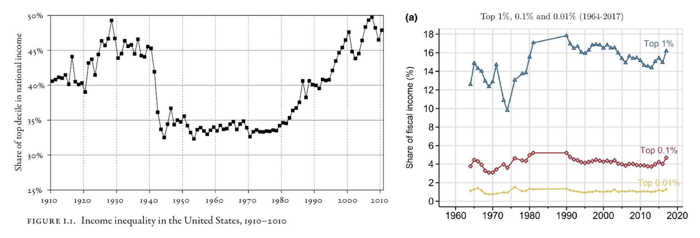
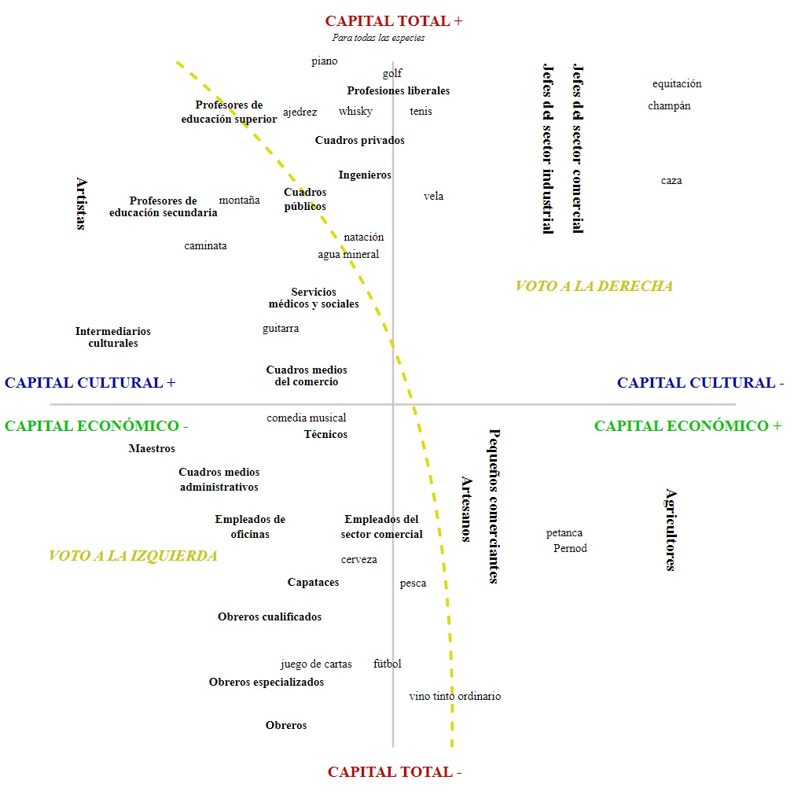
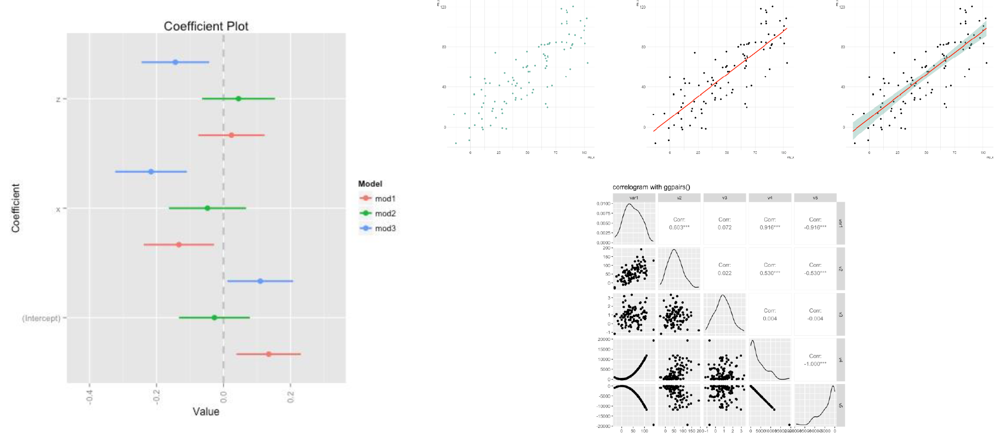

## Objetivos de la Sesión {background-color="white"}

Introducir el concepto de tidy data y el tidyverse como herramienta de trabajo.

Introducir el uso de ggplot en R para ciencias sociales.

## Proceso de Análisis de Datos {.smaller background-color="white"}


## Proceso de Análisis de Datos {.smaller background-color="white"}

La ciencia de datos, y el análisis estadístico, es un proceso iterativo que puede ser resumido en los siguientes pasos:

-   **Importar:** Traer los datos a R desde diversas fuentes (archivos, bases de datos, APIs).
-   **Ordenar (Tidy):** Estructurar los datos de manera consistente: cada variable en una columna, cada observación en una fila.
-   **Transformar:** Modificar los datos para responder preguntas específicas: seleccionar observaciones, crear nuevas variables, calcular resúmenes.
-   **Visualizar:** Explorar los datos gráficamente para descubrir patrones, tendencias y anomalías.
-   **Modelar:** Construir modelos estadísticos para confirmar patrones y realizar predicciones.
-   **Comunicar:** Presentar los resultados de manera efectiva a diferentes audiencias.
-   **Programar:** Utilizar la programación como herramienta transversal para automatizar tareas y resolver problemas en cada etapa.

## El Tidyverse: Un Ecosistema para la Ciencia de Datos en R {.smaller .dark-background}

El **tidyverse** es una colección de paquetes de R diseñados para la ciencia de datos.

-   Comparte una **filosofía** común y facilita el trabajo con datos de manera **intuitiva y eficiente**.
-   El nombre "tidyverse" viene de "tidy data" (**datos ordenados**).
-   Incluye paquetes esenciales como: `dplyr`, `ggplot2`, `tidyr`, `readr`, `purrr`, `stringr`, `forcats`, `lubridate`.

Para instalar e iniciar el tidyverse:

```{r eval=TRUE, echo=TRUE}
#install.packages("tidyverse") # Instalar el tidyverse
library(tidyverse) # Cargar el tidyverse
```

-   Muestra los paquetes principales cargados.
-   Indica posibles conflictos de funciones con otros paquetes (se pueden manejar con `conflicted`).

## Datos Ordenados (Tidy Data): Una Introducción {.smaller background-color="white"}

**Datos ordenados (tidy data)** es una manera consistente de organizar los datos.

-   Facilita el análisis y la manipulación de datos con las herramientas del tidyverse.
-   Aunque requiere un trabajo inicial de organización, **ahorra tiempo a largo plazo** al simplificar el análisis.
-   Las encuestas suelen venir en este formato.

## Reglas de los Datos Ordenados {.smaller background-color="white"}

Para que un conjunto de datos sea considerado **ordenado**, debe cumplir con tres reglas fundamentales:

1.  **Cada variable debe tener su propia columna.**
2.  **Cada observación debe tener su propia fila.**
3.  **Cada valor debe tener su propia celda.**


## Ventajas de los Datos Ordenados {.smaller background-color="white"}

Trabajar con datos ordenados ofrece importantes ventajas:

-   **Consistencia:** Facilita el aprendizaje y uso de herramientas del tidyverse, ya que están diseñadas para trabajar con este formato.
-   **Eficiencia en R:** Permite aprovechar la naturaleza vectorizada de R, simplificando la manipulación y el análisis de datos.
-   **Mayor Claridad:** Estructura intuitiva que facilita la comprensión de los datos y la identificación de variables y observaciones.

Al adoptar el formato tidy, optimizamos nuestro flujo de trabajo en R para el análisis de datos.

## Proceso de Análisis de Datos {background-color="white"}

El sentido de cada una de estas etapas debe estar guiada por una **pregunta de investigación**. Sin una pregunta no podemos determinar que datos necesitamos, en que forma, dodne explorar y visualziar y que modelar y comunicar.

Tomemos un ejemplo simple: **¿Cómo se relaciona la pobreza y la ruralidad en Chile?**

## Importar Datos a R: Ejemplo con CASEN 2022 {.smaller background-color="white"}

Para comenzar a trabajar con datos en R, el primer paso es **importarlos**.

Veamos un ejemplo práctico descargando y cargando la base de datos CASEN 2022:

```{r echo=FALSE, eval=TRUE}
library(haven)
```

```{r echo=TRUE, eval=TRUE, cache=TRUE}
temp <- tempfile() # Creamos un archivo temporal
download.file("https://observatorio.ministeriodesarrollosocial.gob.cl/storage/docs/casen/2022/Base%20de%20datos%20Casen%202022%20SPSS.sav.zip",temp) #descargamos los datos
casen <- haven::read_sav(unz(temp, "Base de datos Casen 2022 SPSS.sav")) #cargamos los datos
unlink(temp); remove(temp) #eliminamos el archivo temporal
```

-   `tempfile()`: Crea un archivo temporal para guardar la descarga.
-   `download.file()`: Descarga el archivo ZIP de la CASEN desde la URL.
-   `haven::read_sav(unz(...))`: Lee el archivo `.sav` (SPSS) dentro del ZIP descargado, utilizando el paquete `haven`.
-   `unlink(temp); remove(temp)`: Elimina el archivo temporal descargado para limpiar el

## Ordenar (Tidy) {.smaller background-color="white"}

Seleccionamos las variables de interés para este ejemplo: `folio` (identificador), `area` (urbana/rural), y `pobreza` (categorías de pobreza). Usamos `select()` de `dplyr` para elegir las columnas y `head()` para mostrar las primeras filas.

```{r echo=TRUE, eval=TRUE}
casen %>%
  select(folio, area, pobreza) %>%
  head()
```

## Transformar {.smaller background-color="white"}

Creamos una nueva variable dicotómica llamada `pobrezad` (pobreza dicotómica). Usamos `mutate()` de `dplyr` y `ifelse()` para asignar valor 1 si la variable `pobreza` original está en las categorías 1 o 2 (pobre o pobre extremo), y 0 en caso contrario.

```{r  echo=TRUE, eval=TRUE}
casen <- casen %>%
  mutate(pobrezad = ifelse(pobreza %in% 1:2, 1, 0))
```

## Visualizar {.smaller background-color="white"}

Visualizamos la relación entre el área de residencia (`area`) y la pobreza dicotómica (`pobrezad`) usando un gráfico de barras.

```{r echo=TRUE, eval=TRUE}
casen %>%
  mutate(area_label = ifelse(area == 1, "Urbana", "Rural")) %>% 
  group_by(area_label) %>% 
  summarise(porcentaje_pobre = mean(pobrezad, na.rm = TRUE) * 100) %>%
  ggplot(aes(x = area_label, y = porcentaje_pobre, fill = area_label)) +
  geom_col(width = 0.5, show.legend = FALSE) +
  geom_text(aes(label = paste0(round(porcentaje_pobre, 1), "%")), 
            vjust = -0.5, size = 5, fontface = "bold") +
  scale_fill_manual(values = c("Rural" = "#FF6F61", "Urbana" = "#5B84B1")) +
  labs(title = "Porcentaje de pobreza según área de residencia",
       x = "Área de Residencia",
       y = "Porcentaje de Pobreza (%)") +
  theme_minimal(base_size = 15)
```

## Modelar {.smaller background-color="white"}

Modelamos la probabilidad de ser pobre (`pobrezad`) en función del área de residencia (`area`) utilizando una regresión logística. Calculamos el Odds Ratio para interpretar el efecto del área rural en comparación con el área urbana.

-   `glm()` ajusta un modelo lineal generalizado. `family = "binomial"` especifica la regresión logística.\
-   `summary(modelo_logistico)` muestra los resultados del modelo.\
-   `exp(coef(modelo_logistico))` calcula el Odds Ratio, exponenciando los coeficientes del modelo. El Odds Ratio para `area` representa el cambio multiplicativo en las odds de ser pobre al pasar del área urbana (referencia) al área rural.

## Modelar {.smaller background-color="white"}

```{r echo=TRUE, eval=TRUE}
modelo_logistico <- glm(pobrezad ~ area, data = casen, family = "binomial")
summary(modelo_logistico)
exp(coef(modelo_logistico)) # Odds Ratio
```

## Comunicar {.smaller background-color="white"}

La regresión logística revela una **asociación significativa y positiva** entre el área de residencia rural y la pobreza. Específicamente, las personas que residen en áreas rurales tienen **odds de ser pobres 1.59 veces mayores** que quienes viven en áreas urbanas (p \< 2e-16).

Este resultado sugiere que el riesgo de pobreza es considerablemente mayor en zonas rurales de Chile, incluso en un modelo simple que solo considera el área de residencia. Este hallazgo destaca la necesidad de políticas públicas diferenciadas y focalizadas en áreas rurales para abordar eficazmente la problemática de la pobreza.


## Vizualización de Datos {.smaller background-color="white"}

“La **visualización** es una actividad humana fundamental. Una buena visualización te mostrará cosas que no esperabas o hará surgir nuevas preguntas acerca de los datos. También puede darte pistas acerca de si estás haciendo las preguntas equivocadas o si necesitas recolectar datos diferentes. Las visualizaciones pueden sorprenderte, pero no escalan particularmente bien, ya que requieren ser interpretadas por una persona.” (Wickham, 2017)

La visualización de datos resulta de gran utilidad en las distintas etapas del análisis de datos, por su capacidad de transmitirnos de manera comprensible grandes cantidades de información. Nos centraremos en su uso para **análisis exploratorio** y para la **comunicación de resultados**.

## Ejemplos de visualización en Ciencias Sociales {.smaller background-color="white"}



## Ejemplos de visualización en Ciencias Sociales {.smaller background-color="white"}

 

## Ejemplos de las técnicas del curso {.smaller background-color="white"}

 

## Visualización en R base {.smaller background-color="white"}

R base contiene algunas herramientas básicas de visualización de datos que nos permitirán obtener rápidamente visualizaciones de los datos para la etapa exploratoria de nuestros análisis.

```{r, echo=FALSE, warning=FALSE, message=FALSE, fig.width=10, fig.height=4}

par(mfrow = c(1, 2))
plot(as_factor(casen$pobreza), main="Situación de pobreza", xlab="Pobreza",ylab="Frequencias",
     col=2)

hist(casen$edad,main="Edad de los encuestados", xlab="Años",ylab="Frequencia")
```

## Construcción de gráficos con ggplot2 {.smaller background-color="white"}

La principal herramienta de visualización de datos en R es el paquete **ggplot2**, que forma parte de tidyverse. ggplot2 implementa la **gramática de los gráficos**, un sistema coherente para describir y construir gráficos.

Su versatilidad y capacidad de obtener resultados visualmente atractivos lo hacen más pertinente para tareas de presentación de resultados, tanto a públicos especializados como no especializados.

Veremos los elementos básicos para poder hacer uso del paquete más adelante en el contexto de las técnicas estadísticas a ver en el curso.

## Gramática de gráficos con ggplot2 {.smaller background-color="white"}


| Elemento    | Descripción                                                                                                                                                                                                                                                                                                           |
|:------------|:----------------------------------------------------------------------------------------------------------------------------------------------------------------------------------------------------------------------------------------------------------------------------------------------------------------------|
| **Datos**   | Conjunto de información que se representará de manera gráfica. En nuestro caso se trata de una o más variables, a una o más observaciones.                                                                                                                                                                            |
| **Estética**| Escala en la cual se posicionará la información en ejes. Refiere al posicionamiento de la información al representar sobre los diferentes ejes y dimensiones del gráfico resultante. La disposición polidimensional de variables en los ejes X y Y como también la posibilidad de indicar valores de un tercer eje, como la posición de las líneas de los diferentes ejes, o una función de transparencia, etc. |
| **Geometría** | Formas, elementos visuales que se emplearán para representar visualmente la información codificada en los datos y ubicada en los diferentes ejes potenciales que mencionamos en la sección anterior. Por ejemplo, puntos para representaciones de dispersión, barras para frecuencias, líneas para tendencias, etc.                                        |

*(Boccardo y Ruiz, RStudio para Estadística Descriptiva en Ciencias Sociales)*  
