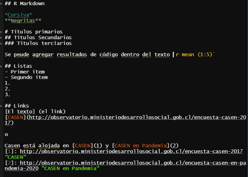
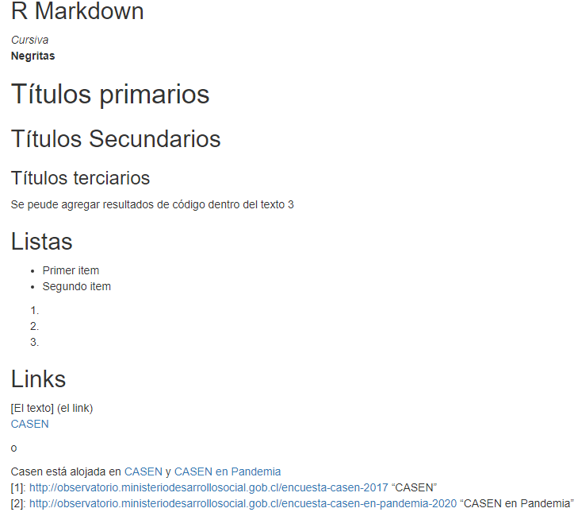
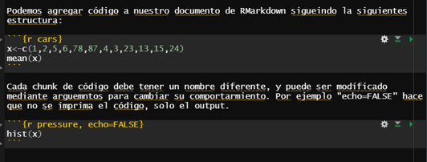
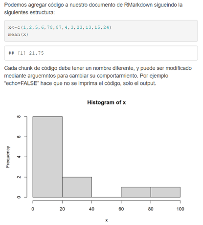
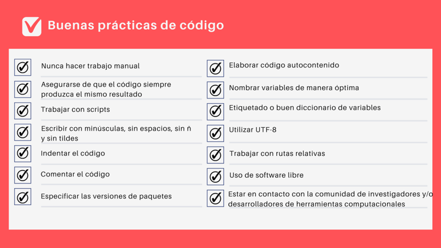

## Objetivos de la sesión {background-color="white"}

Introducir la importancia de la reproducibilidad y el concepto de ciencia abierta

# Reproducibilidad

## Replicación y reproducibilidad {.smaller background-color="white"}

La **replicación** de estudios científicos es fundamental para la construcción de conocimiento. Esta consiste en replicar resultados de investigación con investigadores, datos, métodos de análisis e instrumentos independientes. Esto es especialmente importante cuando se afectan **decisiones de políticas  públicas o regulación.**
Sin embargo, no siempre es posible. Esto puede deberse a límites económicos, de tiempo o a que un estudio depende de algún evento único. 
Un estándar mínimo es la **reproducibilidad**: dejar disponibles los datos y el código de forma que otros puedan reproducir (y evaluar) nuestros resultados. 
A mediad que aumentan los datos y poder computacional disponible esto se hace más relevante.
No solo es importante para la ciencia. 

## ¿Por qué es importante la reproducibilidad? {.smaller background-color="white"}

- **Validez y Confianza**: Refuerza la credibilidad de la investigación al permitir la verificación independiente de los hallazgos.
- **Transparencia**:  Aumenta la transparencia del proceso de investigación, facilitando la detección de errores y sesgos.
- **Acumulación de Conocimiento**: Permite construir sobre investigaciones anteriores de manera más sólida y eficiente.
- **Responsabilidad y Ética**: Aumenta la responsabilidad de los investigadores y promueve prácticas éticas en la producción de conocimiento.
- **Para evitar el caos**: Organizar el trabajo de manera sistemática, facilitando la gestión de proyectos a largo plazo y en equipo.

## Crisis de replicación {.smaller background-color="white"}

Actualmente existen iniciativas destinadas a replicar (o reproducir) estudios científicos publicados, los cual ha dado cuenta de la imposibilidad de hacerlo fruto  de la falta de documentación, datos, o incluso debido a investigadores llegando a resultados diferentes utilizando los mismos datos.   

Esto hace relevante avanzar en mayor **transparencia** en todas las etapas del proceso de investigación. 

# Ciencia abierta

## Ciencia abierta {.smaller background-color="white"}

La investigación reproducible puede pensarse como parte de un marco más amplio: **la ciencia abierta**. 

Esto puede pensarse en todas las etapas del proceso de producción de conocimiento:  
- Diseño de investigación    
- Producción de datos   
- Análisis de datos   
- Publicación   

Basado en la perspectiva de ciencia abierta elaborada por:   


## Diseño transparente {.smaller background-color="white"}

Refiere a contar con estándares transparencia en la realización de estudios que permitan una mejor evaluación de pares.   

Esto es fundamental para evitar mala prácticas como el p-hacking o la construcción de hipótesis ad-hoc.
La principal herramienta son los **pre-registros**.  

Este refiere a publicar (previo a la realización del estudio) 1) las principales hipótesis, 2) procedimientos de recolección de datos y 3) el plan de análisis.  

No siempre es posible diseñar a priori o prever todos los elementos de nuestro análisis: lo importante del pre-registro es que permite distinguir lo que corresponde al plan original y transparentar aquello que emergió posteriormente.   

## Datos abiertos {.smaller background-color="white"}
  
Los datos a partir de los cuales produzcamos nuestros resultados, ya sea que consten de resultados de encuesta, datos administrativos o indicadores. No basta con publicar los datos, necesitamos información que permita su correcta utilización.   
   
Para esto necesitamos dejar públicamente disponible cuatro elementos:  
  
1) Base de datos  
2) Cuestionario  
3) Libro de códigos  
4) Ficha técnica   


## Análisis reproducibles {.smaller background-color="white"}

Se trata de organizar nuestro análisis de tal manera que sea posible para otros/as investigadores/as reproducir los análisis que realizamos, llegando a los resultados publicados. Esto permite conocer todas las decisiones tomadas, y nos obliga a mantener un flujo de trabajo más sistemático.
  
Los pasos a seguir, o elementos a considerar, (en los que profundizaremos luego) son:  
  
1) La estructura del proyecto  
2) Prácticas de código  
3) Documentos dinámicos  
4) Control de versiones  


## Regla de oro de la reproducibilidad {.center background-color="white"}

::: {.center .smaller style="background-color: #fdf2f2; border: 2px solid #e74c3c; border-radius: 8px; padding: 1em; color: #e74c3c;"}
**TODO DEBE DESARROLLARSE EN EL SCRIPT**
:::

## Publicaciones libres {.smaller background-color="white"}

Se trata de eliminar las barreras (Especialmente económicas) al conocimiento. 

Problema de las editoriales académicas.  

Es posible encontrar revistas que cuentan con acceso abierto. Para saber el nivel de apertura de una revista puede encontrase en https://v2.sherpa.ac.uk/romeo/.  

En general, es importante considerar que esto no depende solo de la iniciativa individual, sino también de las instituciones científicas existentes.   

## ¿Porqué es importante esto más allá de la academia? {.smaller background-color="white"}

En primer lugar resulta importante para asegurar la transparencia de la producción científica, haciendo más posible el control público de las decisiones que se toman basadas en el conocimiento producido.   

Para nuestra labor como sociólogos, el trabajo con estándares de reproducibilidad nos permite mantener mayor control de lo que hacemos, mejora su comunicabilidad y en entornos institucionales (e individualmente) permite mantener mejores registros en el tiempo.   

En términos simples, **nos permite evitar el caos** en nuestro trabajo. 


# Herramientas para la reproducibilidad

## Programación literada {.smaller background-color="white"}

Una herramienta central para hacer reportes reproducibles es la programación literada. Esta consiste en documentos que nos permiten integrar lenguaje humano (texto plano) con lenguaje computacional (código).  

Existen múltiples herramientas tales como Latex, Jupyter Notebooks y Markdown. Nos centraremos en esta última.  

**Markdown** es una herramienta de conversión de texto a HTML para desarrollo web. Markdown permite escribir usando texto plano fácil de leer y de escribir, y convertirlo en código estructuralmente válido de HTML.  

Esta integrada en Rstudio mediante Rmarkdown y Quarto.

## Rmarkdown y Quarto {.smaller background-color="white"}


::: {.columns}
::: {.column width="50%"}


- Para hacer un salto de línea deben ponerse **dos espacios**.


:::
::: {.column width="50%"}

:::
:::

## Rmarkdown y Quarto {.smaller background-color="white"}


::: {.columns}
::: {.column width="50%"}




:::
::: {.column width="50%"}

:::
:::

## Buenas prácticas de código {.smaller background-color="white"}

  

## Configuración de chunks {.smaller background-color="white"}

echo - Incluir o no el código en el documentos de salida (por defecto TRUE)  

include – Incluir o no el código y sus resultado luego de ejecutarlo (por defecto TRUE)  

warning – imprimir las advertencias del código (por defecto TRUE)  

Egine – Lenguaje de programación usado en el código (por defecto “R”)  

cache – guardar resultados en chaché para futuros knit (por defecto FALSE)  

cache.path – directorio para guardar el cache (por defecto “cache/”  

## Protocolos de reproducibilidad {.smaller background-color="white"} 
 

::: {.columns}
::: {.column width="80%"}

Para hacer nuestro proyecto de investigación reproducible no solo importa el código, también requerimos que el proyecto este estructurado de manera reproducible, para lo cual existen protocolos. En este caso revisaremos el protocolo IPO (Input-Procesamiento - Output). Esto puede realizarse con R-projects.  

“La implementación de la reproducibilidad en este tipo de protocolos se basa en generar un conjunto de archivos auto-contenidos organizado en una estructura de proyecto que cualquier persona pueda compartir y ejecutar. En otras palabras, debe tener todo lo que necesita para ejecutar y volver a ejecutar el análisis.”

:::
::: {.column width="20%"}

:::
:::


## El Protocolo IPO para Proyectos Reproducibles {.smaller background-color="white"}

- **IPO (Input-Procesamiento-Output)**: Un modelo mental simple para organizar el flujo de trabajo de investigación.
- **Basado en TIER**: Inspirado en el protocolo TIER (Integridad de Enseñanza en Investigación Empírica) para la transparencia.
- **Memorizable y Práctico**: Fácil de recordar y aplicar en la práctica diaria del análisis de datos.
- **Auto-Contenido**:  Busca crear proyectos que contengan todo lo necesario para ser ejecutados y reproducidos por otros.

## Estructura de Carpetas IPO {background-color="white"}

```
├── input/         # Información externa
│   ├── data/
│   │   ├── original/   # Datos originales (sin modificar)
│   │   └── proc/       # Datos procesados (limpios, transformados)
│   ├── imagenes/     # Imágenes externas para el proyecto
│   ├── bib/          # Archivos de bibliografía (.bib)
│   └── prereg/       # Pre-registros del estudio (si existen)
├── procesamiento/  # Scripts de análisis y preparación
│   ├── preparacion.Rmd   # Script de preparación de datos
│   └── analisis.Rmd      # Script de análisis principal
├── output/        # Resultados del procesamiento
│   ├── graphs/     # Gráficos generados
│   └── tables/     # Tablas generadas
├── readme.md      # Descripción general del proyecto
└── paper.Rmd      # Documento principal (paper, reporte)
```

## Carpetas IPO en Detalle: Input {.smaller background-color="white"}

- **`input/`**: Todo lo que "entra" al proyecto desde fuera.
    - **`data/original/`**: **Datos crudos, sin tocar**.  Archivos originales tal como se obtuvieron.  **¡Solo lectura!**
    - **`data/proc/`**: **Datos procesados y limpios**.  Resultado de los scripts de preparación.  Listos para el análisis.
    - **`imagenes/`**:  Logos, fotos, diagramas...  Cualquier imagen externa usada en el proyecto.
    - **`bib/`**:  Archivos `.bib` para la gestión de bibliografía con herramientas como BibTeX o Zotero.
    - **`prereg/`**:  Pre-registros del estudio, si se realizaron (documentos de registro de hipótesis, métodos, etc.).

## Carpetas IPO en Detalle: Procesamiento y Output {.smaller background-color="white"}

- **`procesamiento/`**: El "corazón" del análisis.
    - **`preparacion.Rmd`**: Script (R Markdown) para la limpieza, transformación y preparación de los datos crudos (`input/data/original/`) para el análisis.  **Genera los datos procesados en `input/data/proc/`**.
    - **`analisis.Rmd`**: Script (R Markdown) con el análisis principal.  **Utiliza los datos procesados (`input/data/proc/`) y genera resultados en `output/`**.

- **`output/`**: Los "productos" del análisis.
    - **`graphs/`**:  Gráficos generados por los scripts de análisis.
    - **`tables/`**:  Tablas de resultados, resúmenes, etc., generadas por los scripts.
    - **¡Todo en `output/` debe ser regenerable ejecutando los scripts en `procesamiento/`!**

## Archivos Clave en la Raíz del Proyecto IPO {.smaller background-color="white"}

- **`readme.md`**:  **La "carta de presentación" del proyecto**.
    - Explica **qué** es el proyecto, **cómo** está organizado (estructura IPO), **cómo reproducirlo**, dependencias, etc.
    - Primer archivo que alguien debería leer al abrir el proyecto.
- **`paper.Rmd` (o `.qmd`, `.html`, `.pdf`)**: **El documento principal**.
    - Puede ser un paper, un reporte, una presentación...
    - **Integra el código de análisis, los resultados (de `output/`) y la narrativa** en un documento dinámico y reproducible.
    - Idealmente, utiliza Quarto para la máxima flexibilidad.

## Flujo de Trabajo IPO: Principios Clave {.smaller background-color="white"}

- **Orden ante todo**:  Diseña el proyecto pensando en que alguien (¡o tu "yo" del futuro!) pueda entenderlo y reproducirlo fácilmente.
- **Comentar el código**:  Explica las decisiones importantes en el código.  ¿Por qué haces esto? ¿Qué significa esta transformación?
- **Preparación primero**:  El script `preparacion.Rmd` debe:
    1.  **Cargar datos originales** (`input/data/original/`).
    2.  **Realizar limpieza y transformaciones**.
    3.  **Guardar datos procesados** en `input/data/proc/`.
- **Análisis después**: El script `analisis.Rmd` debe:
    1.  **Cargar datos procesados** (`input/data/proc/`).
    2.  **Realizar el análisis estadístico**.
    3.  **Guardar tablas y gráficos** en `output/graphs/` y `output/tables/`.

## RProject y Rutas Relativas: Claves de la Portabilidad {.smaller background-color="white"}

- **RProject (.Rproj)**:  Convierte la carpeta del proyecto en un proyecto de RStudio.
    - **Directorio de trabajo automático**:  La raíz del proyecto es siempre el directorio de trabajo.  **¡No uses `setwd()`!**
    - **Facilita rutas relativas**:  Permite usar rutas relativas a la raíz del proyecto, haciendo el proyecto portable.
- **Rutas Relativas**:  Describen la ubicación de un archivo **en relación con la ubicación actual** (la raíz del proyecto en RProject).
    - **`../`**: "Un nivel arriba" en la jerarquía de carpetas.
    - **`input/data/original/data.csv`**:  Desde la raíz, entra en `input/`, luego `data/`, luego `original/`, y encuentra `data.csv`.
    - **Ejemplo en `preparacion.Rmd` (dentro de `procesamiento/`) para cargar datos originales**: `read.csv(here::here("input", "data", "original", "data.csv"))` (usando el paquete `here`).

## Control de versiones/Git-hub {.smaller background-color="white"}

::: {.columns}
::: {.column width="60%"}

Él control de versiones consiste en tener un sistema que nos permita mantener registro de los cambios realizados a los archivos del un proyecto (qué, quién y cuándo).  

Git es una herramienta de código abierto que nos permite realizar control de versiones.  

GitHub es una plataforma de desarrollo colaborativo que nos permite usar repositorios locales y remotos.

:::
::: {.column width="40%"}

:::
:::


## Checklist de la investigación reproducible {.smaller background-color="white"}

- Empezar con buena ciencia  
- NO hacer cosas a mano  
- NO hacer cosas con clicks  
- Enseña al computador  
- Usar control de versiones  
- Mantener registro del ambiente de software  
- NO guardes los outuput (guarda los datos y el código)  
- Estableces un semilla  
- Piensa en el proceso completo (daos brutos – datos procesados – análisis – reporte)  


