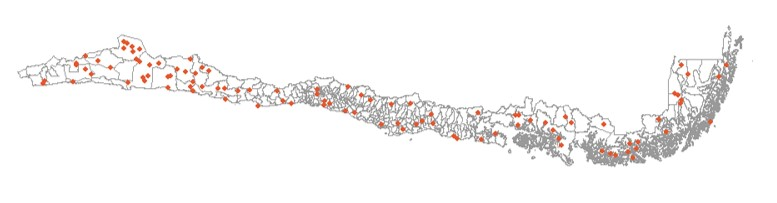

## Objetivos de la Sesión {.smaller background-color="white"}

En esta primera sesión, nos enfocaremos en:

1.  **Comprender** por qué el muestreo es una herramienta **esencial** en la investigación sociológica.
2.  **Identificar** las **limitaciones prácticas** del Muestreo Aleatorio Simple (MAS) en contextos reales.
3.  **Introducir** los conceptos clave detrás de los **diseños muestrales complejos**:
    -   Estratificación
    -   Conglomerados
    -   Ponderadores (factores de expansión)
4.  **Justificar** la necesidad de usar **software especializado** (como R) para analizar datos de encuestas complejas.

## El Desafío: Conocer lo Social {.smaller background-color="white"}

::: columns
::: {.column width="60%"}
En sociología, queremos entender fenómenos que afectan a **grandes poblaciones**:

-   Niveles de pobreza en Chile.
-   Opinión pública sobre una nueva ley.
-   Condiciones laborales de los jóvenes.
-   Acceso a la salud de migrantes.

**Pregunta clave:** ¿Cómo podemos decir algo **válido** sobre *toda* la población (ej. todos los chilenos) si solo podemos estudiar a *una parte* de ella?
:::

::: {.column width="40%"}

:::
:::


## La Solución: Muestreo e Inferencia {.smaller background-color="white"}

-   **Muestreo:** El proceso de **seleccionar** un subconjunto (la **muestra**) de una población más grande (el **universo**).
-   **Inferencia Estadística:** El proceso de usar la información de la muestra para **sacar conclusiones** (inferir) sobre toda la población.

**Idea Central:** Si seleccionamos la muestra de forma **adecuada** (probabilística), podemos **generalizar** los resultados observados en la muestra a la población completa, **cuantificando la incertidumbre** de esa generalización (error muestral).

Esto es crucial para la **validez externa** de nuestras investigaciones.

## El Punto de Partida Ideal: Muestreo Aleatorio Simple (MAS) {.dark-background}

Imaginemos una **tómbola gigante** con el nombre de *cada persona* de nuestra población de interés.

**MAS:** Cada persona tiene **exactamente la misma probabilidad** de ser seleccionada para la muestra.


## MAS: Ventajas Teóricas {.smaller background-color="white"}

El MAS es la base de gran parte de la **estadística inferencial** que aprendemos inicialmente:

-   **Fórmulas "simples"** para calcular:
    -   Medias poblacionales (μ) a partir de medias muestrales (x̄).
    -   Proporciones poblacionales (P) a partir de proporciones muestrales (p̂).
    -   Errores estándar (SE), que miden la variabilidad de nuestras estimaciones.
    -   Intervalos de Confianza (IC), que nos dan un rango plausible para el valor poblacional.
    -   Pruebas de hipótesis (test t, chi-cuadrado, etc.).
-   **Intuición:** Si todos tienen la misma chance de ser elegidos, la muestra "en promedio" debería parecerse a la población.

**Pero... ¿funciona así en la práctica?**

## La Realidad Golpea: ¿Por Qué el MAS Falla a Menudo? {.dark-background}

Aunque conceptualmente simple, el MAS enfrenta **grandes desafíos** en la investigación social del mundo real.

```{=html}
<div style="text-align: center; margin-top: 30px;">
<span style="font-size: 3em; color: #e74c3c;">🚧</span>
<p style="font-size: 1.2em; margin-top: 10px;">Veamos tres problemas principales.</p>
</div>
```
## Problema 1: Marcos Muestrales Incompletos {.smaller background-color="white"}

El MAS requiere una **lista completa y actualizada** de **todos** los individuos de la población objetivo (el **marco muestral**).

**Preguntas:**

-   ¿Existe una lista con *todos* los habitantes de Chile y su información de contacto actualizada? **No.** (El Censo se acerca, pero no es una lista de contacto directa y se desactualiza).
-   ¿Tenemos listas completas de poblaciones específicas como "jóvenes", "trabajadores informales", "migrantes recientes"? **Aún más difícil.**

**Consecuencia:** Si nuestro marco muestral no cubre a toda la población, la muestra seleccionada (incluso si es aleatoria *dentro* del marco) **no será representativa** de la población *completa*. Esto se llama **error de cobertura**.

*(Ejemplo: Una encuesta telefónica basada en teléfonos fijos hoy excluiría sistemáticamente a quienes solo usan celular).*

## Problema 2: Costos y Logística {.smaller background-color="white"}

Imaginemos seleccionar 1000 personas al azar en todo Chile usando MAS.

**Desafíos:**

-   **Dispersión Geográfica:** Los seleccionados estarían repartidos por todo el país, desde Arica hasta Punta Arenas, en zonas urbanas y rurales remotas.
-   **Costos Elevados:** Visitar (o incluso contactar eficazmente) a cada persona seleccionada sería **extremadamente caro** en tiempo y recursos (traslados, viáticos, personal).
-   **Factibilidad:** En muchos casos, simplemente **no es viable** implementar un MAS puro a gran escala por razones presupuestarias y logísticas.

```{=html}
<div style="text-align: center;">

<p style="font-size: 0.8em; margin-top: 5px;"><em>MAS puro implica una muestra muy dispersa geográficamente.</em></p>
</div>
```
## Problema 3: Representatividad de Subgrupos {.smaller background-color="white"}

Supongamos que queremos estudiar la situación de un grupo específico que es pequeño en la población total (ej. Aymaras en la Región Metropolitana, \~0.1% de la población).

-   Con MAS, la probabilidad de incluir a miembros de este grupo en una muestra de tamaño moderado (ej. 1500 personas) es **muy baja**.
-   Podríamos terminar con **muy pocos casos** (o ninguno) de este subgrupo, impidiendo realizar análisis significativos sobre ellos.

**Consecuencia:** El MAS **no garantiza** una representación adecuada de **subgrupos pequeños pero importantes** para nuestra investigación. Necesitamos estrategias para asegurarnos de incluirlos.

## Adaptándonos: Estrategias de Muestreo Complejo {.smaller .dark-background}

Frente a las limitaciones del MAS, los investigadores desarrollaron métodos más **prácticos y eficientes** para encuestas reales.

**Idea Clave:** Abandonamos la idea de que *todos* tengan la *misma* probabilidad de selección inicial, pero mantenemos el **muestreo probabilístico** (probabilidades conocidas y \> 0) y usamos técnicas para **corregir** las desigualdades y la estructura del muestreo.

**Principales Estrategias:**

1.  **Estratificación**
2.  **Muestreo por Conglomerados**
3.  **(Como consecuencia) Ponderación**

## Estrategia 1: Estratificación {.smaller background-color="white"}

-   **¿Qué es?** Dividir la población total en **subgrupos homogéneos (estratos)** *antes* de realizar el muestreo. Luego, se realiza un muestreo (a menudo MAS o sistemático) *dentro* de cada estrato.
-   **Ejemplos de Estratos Comunes:**
    -   Geográficos: Regiones, Provincias, Comunas, Zona Urbana/Rural.
    -   Socioeconómicos: Nivel Socioeconómico (NSE), Nivel Educacional.
    -   Demográficos: Grupos de edad, Sexo.
    
## Estrategia 1: Estratificación {.smaller background-color="white"}
    
-   **¿Por qué estratificar?**
    1.  **Asegurar Representatividad:** Garantiza que todos los subgrupos definidos como estratos estén presentes en la muestra, incluso los pequeños (podemos *sobrerrepresentarlos* si es necesario).
    2.  **Mejorar Precisión:** Si las unidades dentro de cada estrato son más parecidas entre sí (homogéneas) respecto a la variable de interés que las unidades de estratos diferentes, la estratificación reduce el error estándar de las estimaciones globales.
    3.  **Permite Análisis por Estrato:** Facilita obtener estimaciones específicas para cada subgrupo definido como estrato.

## Estratificación en CASEN {.smaller background-color="white"}

La Encuesta CASEN utiliza múltiples niveles de estratificación:

1.  **Geográfica:**
    -   Región
    -   Provincia
    -   Comuna
    -   Área (Urbana / Rural)
2.  **Socioeconómica (dentro de Comuna-Área):**
    -   Se agrupan las "manzanas" o "secciones censales" (que luego serán las UPMs) en Niveles Socioeconómicos (NSE) basados en datos del Censo (ej. Bajo, Medio, Alto).

**Resultado:** La muestra se selecciona dentro de cruces muy específicos, como "Comuna X, Área Urbana, NSE Alto". Esto asegura representación territorial y socioeconómica. 


## Estrategia 2: Muestreo por Conglomerados {.smaller background-color="white"}

-   **¿Qué es?**
    1.  Dividir la población en **grupos (conglomerados)**, generalmente geográficos (ej. manzanas, sectores censales, edificios).
    2.  Seleccionar una **muestra aleatoria de conglomerados**.
    3.  Dentro de los conglomerados **seleccionados**, encuestar a **todas** las unidades (muestreo monoetápico por conglomerados) o seleccionar una **muestra aleatoria de unidades** (muestreo bietápico o polietápico).

## Estrategia 2: Muestreo por Conglomerados {.smaller background-color="white"}
  
-   **Ejemplo Bi-etápico (Común en encuestas de hogares como CASEN):**
    1.  **Etapa 1:** Seleccionar Manzanas/Sectores (Unidades Primarias de Muestreo - UPM).
    2.  **Etapa 2:** Dentro de las UPM seleccionadas, seleccionar Viviendas (Unidades Secundarias de Muestreo - USM).
    3.  (Etapa 3 implícita): Dentro de las viviendas seleccionadas, encuestar a todos los hogares/personas.
-   **¿Por qué usar conglomerados?**
    -   **¡Reducción drástica de Costos y Logística!**
        -   No se necesita un marco muestral de *todas* las viviendas del país, solo de los conglomerados (Etapa 1) y luego listas de viviendas *solo* en los conglomerados seleccionados (Etapa 2).
        -   Concentra geográficamente el trabajo de los encuestadores.

## Conglomerados: La Contrapartida - Efecto de Diseño {.smaller background-color="white"}

Si bien los conglomerados ahorran costos, tienen una consecuencia estadística:

-   **Intuición:** Las personas que viven cerca (en la misma manzana, en el mismo edificio) tienden a **parecerse más entre sí** en ciertas características (ingresos, opiniones, estilos de vida) que personas elegidas completamente al azar en la ciudad.
-   **Consecuencia Estadística:** Cada entrevista dentro de un conglomerado aporta "menos información nueva" que una entrevista seleccionada independientemente (MAS). La información es, en parte, redundante.

## Conglomerados: La Contrapartida - Efecto de Diseño {.smaller background-color="white"}

-   **Efecto de Diseño (DEFF):** Mide cuánto aumenta la **varianza** (y por ende, el error estándar) de una estimación debido al uso de conglomerados, comparado con un MAS del mismo tamaño.
    -   `DEFF = Varianza_DiseñoComplejo / Varianza_MAS`
    -   Un DEFF \> 1 (típico en conglomerados) significa que nuestra estimación es **menos precisa** que si hubiéramos hecho un MAS con el mismo número de entrevistas. Necesitaríamos una muestra *más grande* para alcanzar la misma precisión que un MAS.

## Conglomerados en CASEN {.smaller background-color="white"}

CASEN utiliza un diseño **bietápico** (dos etapas de selección):

1.  **Etapa 1 (Selección de UPM):** Dentro de cada estrato (Comuna-Área-NSE), se seleccionan **Unidades Primarias de Muestreo (UPM)**. Estas UPMs son agrupaciones geográficas (similares a sectores censales o conjuntos de manzanas) construidas por el INE. Se seleccionan con probabilidad proporcional a su tamaño (número de viviendas).
2.  **Etapa 2 (Selección de Viviendas):** Dentro de cada UPM seleccionada, se **actualiza el listado de viviendas** (trabajo de terreno o gabinete) y se selecciona una **muestra sistemática de viviendas**.

Esto hace que la logística sea manejable, pero introduce un efecto de diseño que debemos considerar en el análisis.

## Consecuencia Lógica: Probabilidades Desiguales {.smaller .dark-background}

Cuando combinamos **estratificación** (donde podemos sobrerrepresentar estratos) y **muestreo por conglomerados** (especialmente si se seleccionan con probabilidad proporcional al tamaño y/o el número de unidades en la segunda etapa varía)...

...el resultado es que **no todos los individuos o viviendas en la población tienen la misma probabilidad final de ser incluidos en la muestra.**

> ¡Hemos roto el supuesto fundamental del MAS!

¿Cómo resolvemos esto para poder hacer inferencia válida?

## La Solución: Ponderadores (Factores de Expansión) {.smaller background-color="white"}

-   **¿Qué son?** Un **peso (ponderador o factor de expansión)** asignado a cada unidad final de la muestra (ej. cada persona encuestada).
-   **¿Qué representa?** Indica a **cuántas unidades de la población** representa esa unidad específica de la muestra.
    -   Si una persona tiene un peso de 500, significa que representa a sí misma y a otras 499 personas de la población con características similares (según el diseño).

## La Solución: Ponderadores (Factores de Expansión) {.smaller background-color="white"}

-   **¿Cómo se calculan (básicamente)?** Son (aproximadamente) la **inversa de la probabilidad de selección** de esa unidad.
    -   Si alguien tuvo una probabilidad de 1/500 de ser seleccionado, su peso base será 500.
    -   Si alguien tuvo una probabilidad de 1/200 (porque pertenecía a un estrato sobrerrepresentado), su peso base será 200.
-   **Propósito:** **Corregir las probabilidades desiguales de selección**, permitiendo que las estimaciones muestrales (medias, totales, proporciones) reflejen correctamente a la población total.

## Ponderadores: Ajustes Adicionales {.smaller background-color="white"}

Los ponderadores que encontramos en las bases de datos como CASEN suelen incluir ajustes más allá de la probabilidad de selección inicial:

1.  **Ajuste por No Respuesta:** Corrige el hecho de que no todas las unidades seleccionadas participan (algunas rechazan, no se encuentran, etc.). Se intenta dar más peso a los que sí respondieron para compensar a los que no, asumiendo que son similares (dentro de ciertos grupos).
2.  **Ajuste por Post-Estratificación (Calibración):** Ajusta los pesos para que las sumas ponderadas de la muestra coincidan con **totales poblacionales conocidos** de fuentes externas (ej. proyecciones de población del INE por Región-Sexo-Edad). Esto mejora la precisión y consistencia de las estimaciones.


## ¡Usa los Ponderadores! {.dark-background .smaller}

Si trabajas con datos de una encuesta con diseño complejo (como CASEN):

<br>

**NUNCA** calcules estimaciones (medias, porcentajes, totales) simplemente promediando o contando los datos **sin usar los factores de expansión (ponderadores)**.

<br>

**Ignorar los ponderadores lleva a:**

-   **Estimaciones SESGADAS:** No representan a la población real, sino a la muestra *tal como fue seleccionada* (con sus sobrerrepresentaciones y subrepresentaciones).
-   **Conclusiones ERRÓNEAS** sobre la población.

> **¡El ponderador es la llave para generalizar correctamente!**

## El Impacto en el Análisis: ¿Por Qué Software Especial? {.smaller background-color="white"}

Hemos visto que las muestras complejas (estratificadas, conglomeradas, con pesos) rompen los supuestos del MAS.

**¿Qué implica esto para nuestros análisis estadísticos?**

1.  **Estimaciones Puntuales:** Deben calcularse usando los **ponderadores** para evitar sesgos (ej. media ponderada, proporción ponderada).
2.  **Estimaciones de Varianza (y Error Estándar, ICs):** Las fórmulas "simples" (las que usa `mean()`, `sd()`, `lm()`, `t.test()` por defecto en R base) son **INCORRECTAS**. Ignoran la estratificación, los conglomerados y los pesos.
    -   Generalmente, **subestiman** el error estándar real (especialmente por los conglomerados).
    
## El Impacto en el Análisis: ¿Por Qué Software Especial? {.smaller background-color="white"}

3.  **Pruebas de Hipótesis y Modelos:** P-valores, tests t, chi-cuadrado, coeficientes de regresión y *sus errores estándar* deben calcularse considerando el diseño muestral.
    -   Usar funciones estándar puede llevar a encontrar **falsos positivos** (declarar efectos o diferencias significativas que no lo son en la población).

## La Necesidad de Herramientas Específicas {.smaller background-color="white"}

Para analizar correctamente datos de encuestas complejas, necesitamos software que pueda:

1.  **Incorporar los Ponderadores** en los cálculos de estimaciones puntuales.
2.  **Utilizar la información de Estratos y Conglomerados** para estimar correctamente las varianzas y errores estándar.

**En el mundo R, los paquetes clave para esto son:**

-   **`survey`:** El paquete fundamental y más completo, desarrollado por Thomas Lumley. Ofrece una amplia gama de funciones para describir el diseño y realizar análisis.
-   **`srvyr`:** Una "envoltura" (wrapper) alrededor de `survey` que utiliza la sintaxis familiar del **tidyverse** (`dplyr`), haciendo el análisis más intuitivo para quienes ya usan `group_by`, `summarise`, etc.

## El Rol de la Documentación de la Encuesta {.smaller background-color="white"}

Para poder usar `survey` o `srvyr`, necesitamos saber **cómo** se diseñó la muestra.

La **documentación técnica** de la encuesta (como el "Diseño Muestral Casen 2022" que les compartí) es **FUNDAMENTAL**. Nos dice:

-   Cuál es la variable de **ponderación** (`expr`, `expc`, etc.).
-   Cuál es la variable que identifica los **estratos** (`varstrat` en CASEN).
-   Cuál es la variable que identifica los **conglomerados/UPM** (`varunit` en CASEN).
-   Otros detalles importantes (ej. si los IDs de UPM se repiten entre estratos - `nest=TRUE`).

**¡Siempre lee la documentación antes de analizar!**

## Próximos Pasos: ¡A Practicar! {.smaller background-color="white"}

En el bloque práctico de hoy:

1.  **Cargaremos** la base de datos CASEN 2022.
2.  **Identificaremos** las variables clave del diseño muestral (ponderador, estrato, conglomerado).
3.  Realizaremos un cálculo **"ingenuo"** (ignorando el diseño) para comparar.
4.  **Declararemos** el diseño muestral complejo a R usando `survey::svydesign()`.
5.  Haremos nuestro **primer cálculo ponderado** con `survey::svymean()` y veremos la diferencia.
