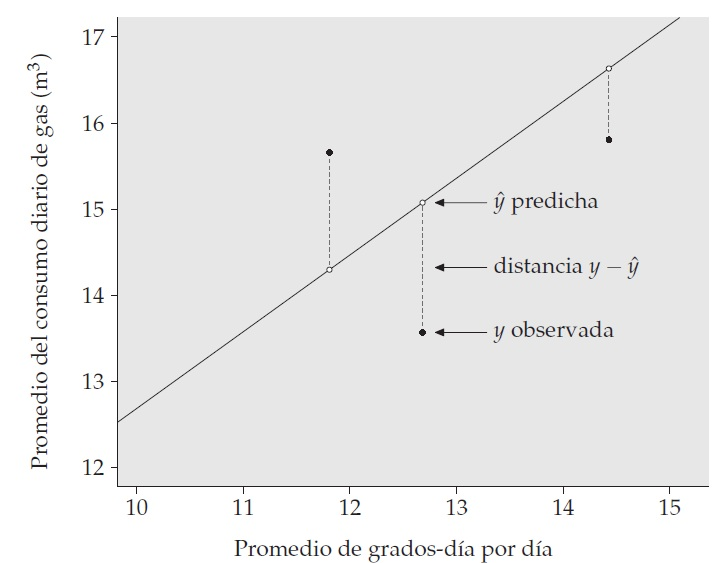
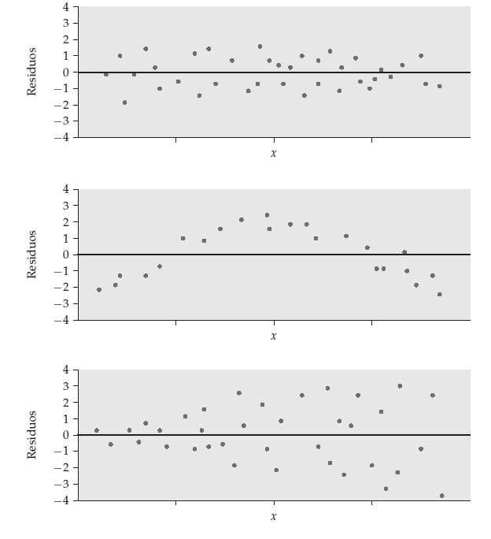

## Objetivos de la Sesión {.smaller background-color="white"}

En esta sesión, construiremos las bases para el análisis multivariado:

1.  **Entender** por qué usamos **modelos multivariados** en sociología y sus funciones principales.
2.  **Diferenciar** entre enfoques **exploratorios** y **confirmatorios**, y entre modelos de **medición** y **relacionales**.
3.  **Repasar** conceptos estadísticos clave: **varianza, covarianza, correlación** (Pearson y brevemente poli/tetracórica).
4.  **Revisitar** la **regresión lineal múltiple (RLM)**, enfatizando el **control estadístico** y la interpretación de **coeficientes estandarizados**.
5.  Comprender la lógica de la **inferencia estadística** en regresión (test de hipótesis sobre coeficientes) y su **importancia (y limitación con `lm`)** en diseños complejos.

# Parte I: El Mundo de los Modelos Multivariados

## ¿Por Qué Modelos Multivariados? {.smaller .dark-background}

La realidad social es **compleja**. Los fenómenos que estudiamos (desigualdad, movilidad social, opinión pública, comportamiento electoral...) raramente dependen de *una sola* causa.

*   **Análisis Bivariado (Correlación, t-test, Chi²):** Útil para explorar relaciones iniciales entre *dos* variables, pero limitado. No captura la red de influencias simultáneas.
*   **Modelos Multivariados:** Son nuestra herramienta para representar y analizar sistemas con **múltiples variables interactuando**. Nos permiten:
    *   **Describir** relaciones complejas.
    *   **Explicar** fenómenos considerando múltiples factores y **controlando** por variables alternativas.
    *   **Predecir** resultados con mayor precisión.
    *   **Testear** teorías sociológicas que postulan relaciones múltiples.

## Funciones de los Modelos en Cs. Sociales {.smaller background-color="white"}

Los modelos multivariados nos sirven para:

1.  **Formalizar Teorías:** Traducir ideas teóricas verbales a relaciones específicas entre variables, permitiendo rigurosidad y testeo empírico.
2.  **Identificar Efectos Netos:** Aislar el impacto de una variable de interés sobre otra, eliminando estadísticamente la influencia de terceras variables (control estadístico). *¿Cuál es el efecto "puro" de la educación sobre el ingreso, una vez que consideramos la experiencia laboral y el origen socioeconómico?*
3.  **Descubrir Estructuras Subyacentes:** Encontrar patrones ocultos o dimensiones latentes en conjuntos grandes de variables (Ej: ¿Qué dimensiones básicas explican las respuestas a una batería de preguntas sobre actitudes políticas?).
4.  **Evaluar Ajuste Teoría-Datos:** Determinar si un modelo teórico propuesto es compatible con los datos observados.

## Un Mapa para Navegar los Modelos {.smaller background-color="white"}

Podemos organizar los modelos que veremos en el curso (y otros) según dos ejes principales:

**Eje 1: ¿Exploramos o Confirmamos?**

*   **Modelos Exploratorios:** ¿Qué nos dicen los datos? Buscamos patrones sin una hipótesis fuerte *a priori*.
*   **Modelos Confirmatorios:** ¿Se ajustan los datos a mi teoría? Testeamos una estructura hipotetizada previamente.

**Eje 2: ¿Medimos Conceptos o Relacionamos Variables?**

*   **Modelos de Medición:** ¿Cómo se relacionan los indicadores observables con un concepto latente?
*   **Modelos Relacionales (o Estructurales):** ¿Cómo se relacionan distintas variables (observadas o latentes) entre sí?

## Eje 1: Exploratorio vs. Confirmatorio  {.smaller background-color="white"}

*   **Análisis Factorial Exploratorio (AFE):**
    *   **Objetivo:** Identificar factores o dimensiones latentes comunes que explican las correlaciones entre un conjunto de variables observadas (ítems de una escala, indicadores).
    *   **Pregunta:** ¿Cuántas dimensiones subyacen a estos 20 ítems sobre bienestar? ¿Qué ítems cargan en qué dimensión?
    *   Guiado por los datos, busca descubrir estructura.

## Eje 1: Exploratorio vs. Confirmatorio  {.smaller background-color="white"}

*   **Análisis Factorial Confirmatorio (AFC), Análisis de Senderos, Modelos de Ecuaciones Estructurales (SEM):**
    *   **Objetivo:** Testear si una estructura de relaciones (entre ítems y factores, o entre diferentes factores/variables) definida *previamente* por la teoría se ajusta bien a los datos observados.
    *   **Pregunta:** ¿Confirman los datos que la "autoeficacia" (medida por 4 ítems) predice el "rendimiento académico" (medido por notas), controlando por "apoyo familiar" (medido por 3 ítems)?
    *   Guiado por la teoría, busca validar un modelo específico.

## Eje 2: Medición vs. Relacional {.smaller background-color="white"}

*   **Modelos de Medición:**
    *   Se enfocan en la **calidad de la medición**. ¿Son fiables y válidos nuestros indicadores para medir el concepto abstracto que nos interesa?
    *   Central en **AFE** (¿qué miden los factores?) y **AFC** (¿miden bien los ítems el factor que *creemos* que miden?).

*   **Modelos Relacionales / Estructurales:**
    *   Se enfocan en las **relaciones entre variables** (sean observadas o latentes).
    *   **Regresión Lineal Múltiple (RLM):** Relaciona variables observadas.
    *   **Análisis de Senderos:** Modela relaciones más complejas hipotetizadas entre variables *observadas*.
    *   **Modelos de Ecuaciones Estructurales (SEM):** El más general. Modela relaciones entre variables *latentes* y/o *observadas*, combinando modelos de medición y modelos relacionales.

*(Estos ejes no son excluyentes, SEM por ejemplo, incluye ambos tipos de modelos).*

# Parte II: Repaso de Conceptos Estadísticos Clave

## Variabilidad y Dispersión {.smaller background-color="white"}

Para entender relaciones, primero necesitamos entender cómo varían las variables por sí solas.

*   **Varianza ($s^2$):** Promedio de las distancias al cuadrado de cada dato respecto a la media. Mide la dispersión total, pero en unidades al cuadrado (difícil interpretación directa).
    $$ s^2 = \frac{\sum (x_i - \bar{x})^2}{n-1} $$
*   **Desviación Estándar ($s$):** Raíz cuadrada de la varianza. Vuelve a las unidades originales de la variable. Es la medida de dispersión más usada e interpretable.
    $$ s = \sqrt{s^2} $$

**Mayor $s$ -> Mayor heterogeneidad / dispersión.**

## Variabilidad y Dispersión {.smaller background-color="white"}

```{r echo=F}
library(gridExtra)
library(ggplot2)
library(dplyr)
library(dplyr)


datos <- readRDS("data/datos.rds") %>% 
  filter(brecha<40 & brecha > -20 & !is.na(brecha))
datos <- datos %>%
  mutate(escolaridad_cat = cut(promedio_anios_escolaridad25_2017, 
                               breaks = seq(floor(min(promedio_anios_escolaridad25_2017, na.rm = TRUE)), 
                                            ceiling(max(promedio_anios_escolaridad25_2017, na.rm = TRUE)), 
                                            by = 1), 
                               include.lowest = TRUE))

# Calcular la media de la brecha salarial
mean_brecha <- mean(datos$brecha, na.rm = TRUE)

ggplot(datos[order(datos$brecha), ], aes(x = seq_along(brecha), y = brecha)) +
  geom_point(color = "#42affa", size = 3) +  # Puntos de datos
  geom_hline(yintercept = mean_brecha, color = "red", linetype = "dashed", size = 1) +  # Línea de la media
  geom_segment(aes(xend = seq_along(brecha), yend = mean_brecha), color = "#ffa500", size = 0.5) +  # Líneas desde cada punto hasta la media
  labs(
    x = "Índice",
    y = "Brecha Salarial de Género (%)",
    title = "Distancia de cada punto a la Media de la Brecha Salarial"
  ) +
  theme_minimal(base_size = 14) +  # Tamaño de fuente base
  theme(
    plot.title = element_text(hjust = 0.5, face = "bold"),  # Centra y pone en negrita el título
    axis.title = element_text(face = "bold"),  # Negrita para los títulos de los ejes
    axis.text = element_text(color = "#333333"),  # Color del texto en los ejes
    panel.grid.major = element_line(color = "#d3d3d3"),  # Color de las líneas de la cuadrícula mayor
    panel.grid.minor = element_blank()  # Elimina las líneas de la cuadrícula menor
  )


```


## Co-Variación: Covarianza y Correlación {.smaller background-color="white"}

¿Cómo varían *dos variables juntas*?

*   **Covarianza:** Mide la dirección de la relación lineal entre dos variables.
    $$ Cov(x,y) = \frac{\sum (x_i - \bar{x})(y_i - \bar{y})}{n-1} $$
    *   Signo (+): Relación directa (si X sube, Y tiende a subir).
    *   Signo (-): Relación inversa (si X sube, Y tiende a bajar).
    *   **Problema:** Su magnitud depende de las escalas de X e Y. No permite comparar fuerza de asociación entre distintos pares de variables.

## Co-Variación: Covarianza y Correlación {.smaller background-color="white"}

*   **Correlación de Pearson (r):** La covarianza estandarizada.
    $$ r = \frac{Cov(x,y)}{s_x s_y} $$
    *   Varía entre -1 y +1.
    *   **+1:** Correlación lineal positiva perfecta.
    *   **-1:** Correlación lineal negativa perfecta.
    *   **0:** Ausencia de correlación *lineal*.
    *   **Ventaja:** Adimensional, permite comparar la *fuerza* de la relación lineal.
    *   **Limitación Central:** **Sólo mide relaciones LINEALES.** Una correlación de 0 no significa que no haya *ninguna* relación (podría ser curvilínea).
    
## Graficos de dispersión y correlación {background-color="white"}

```{r echo=F}

# Función para crear un conjunto de datos con una correlación específica
crear_datos <- function(n, cor) {
  x <- rnorm(n)
  y <- cor * x + sqrt(1 - cor^2) * rnorm(n)
  data.frame(x = x, y = y)
}

# Crear seis conjuntos de datos con diferentes correlaciones
set.seed(42)
datos_0 <- crear_datos(100, 0)
datos_neg03 <- crear_datos(100, -0.3)
datos_pos05 <- crear_datos(100, 0.5)
datos_neg07 <- crear_datos(100, -0.7)
datos_pos09 <- crear_datos(100, 0.9)
datos_neg099 <- crear_datos(100, -0.99)

# Función para crear gráficos con líneas de la media
crear_grafico <- function(data, title) {
  ggplot(data, aes(x = x, y = y)) + 
    geom_point() + 
    geom_vline(xintercept = mean(data$x), color = "red", linetype = "dotted") +  # Línea vertical para la media de x
    geom_hline(yintercept = mean(data$y), color = "red", linetype = "dotted") +  # Línea horizontal para la media de y
    labs(title = title) + 
    theme_minimal()
}

# Crear los gráficos individuales con líneas de la media
g0 <- crear_grafico(datos_0, "Correlación r = 0")
g_neg03 <- crear_grafico(datos_neg03, "Correlación r = -0.3")
g_pos05 <- crear_grafico(datos_pos05, "Correlación r = 0.5")
g_neg07 <- crear_grafico(datos_neg07, "Correlación r = -0.7")
g_pos09 <- crear_grafico(datos_pos09, "Correlación r = 0.9")
g_neg099 <- crear_grafico(datos_neg099, "Correlación r = -0.99")

# Organizar los gráficos en una cuadrícula 2x3
grid.arrange(g0,g_pos05, g_pos09,g_neg03, g_neg07, g_neg099, ncol = 3)

```

## Correlaciones para Datos No Continuos {.smaller background-color="white"}

¿Qué hacemos si nuestras variables son **ordinales** (ej. escalas Likert: "Muy en desacuerdo" a "Muy de acuerdo") o **dicotómicas** (ej. Sí/No, Hombre/Mujer)? Pearson no es ideal.

**Idea Clave:** Suponer que detrás de la variable categórica observada existe una **variable latente continua** (no observable) que sigue una distribución normal. Lo que observamos son "cortes" en esa distribución latente.

*   **Correlación Policórica:** Estima la correlación entre las *variables latentes continuas* asumidas detrás de dos variables **ordinales**.
*   **Correlación Tetracórica:** Estima la correlación entre las *variables latentes continuas* asumidas detrás de dos variables **dicotómicas**.


## Correlaciones para Datos No Continuos {.smaller background-color="white"}

**¿Por qué son importantes?**  
*   El **Análisis Factorial (AFE/AFC)** se basa en analizar la **matriz de correlaciones** entre las variables.  
*   Si tenemos variables ordinales o dicotómicas, usar la matriz de correlaciones de Pearson puede distorsionar los resultados del AFE/AFC. Es **más adecuado** usar una matriz de correlaciones policóricas/tetracóricas (o mixtas).  

*(En R, el paquete `polycor` permite calcularlas).*

# Parte III: De la Correlación a la Regresión Lineal

## Más Allá de la Asociación: Regresión Lineal Simple (RLS) {.smaller background-color="white"}

La correlación nos dice *si* y *cómo* X e Y varían juntas linealmente. La **Regresión Lineal Simple** va un paso más allá: intenta **modelar** esa relación y **predecir** el valor de la variable dependiente (Y) a partir de la variable independiente (X) usando una **línea recta**.

**Ecuación de la Recta de Regresión:**
$$ \hat{y} = a + bx $$

*   $\hat{y}$: Es el valor de Y **predicho** por el modelo para un valor dado de X.
*   $a$: Es el **intercepto** (o constante). Representa el valor predicho de Y cuando X es igual a 0. Su interpretación práctica depende de si X=0 tiene sentido en el contexto del problema.
*   $b$: Es la **pendiente** (o coeficiente de regresión). Indica el **cambio promedio estimado** en Y por cada **incremento de una unidad** en X. Es la medida clave del efecto de X sobre Y en este modelo.

## Visualizando la RLS  {.smaller background-color="white"}

La recta de regresión busca ser la línea que "mejor representa" la tendencia lineal en la nube de puntos de un diagrama de dispersión. La recta resume la relación lineal promedio.

```{r}
# Crear categorías de escolaridad para calcular medias condicionales


# Calcular medias condicionales
medias_condicionales <- datos %>%
  group_by(escolaridad_cat) %>%
  summarize(
    media_brecha = mean(brecha, na.rm = TRUE),
    media_escolaridad = mean(promedio_anios_escolaridad25_2017, na.rm = TRUE)
  )

mean_brecha <- mean(datos$brecha, na.rm = TRUE)

ggplot(datos, aes(x = promedio_anios_escolaridad25_2017, y = brecha)) +
  geom_point(color = "#0073C2", size = 3, alpha = 0.7) +  # Puntos más grandes y ligeramente transparentes
  geom_smooth(method = "lm", color = "black", linetype = "solid", se = FALSE) +  # Línea de tendencia en negro
  geom_vline(xintercept = mean(datos$promedio_anios_escolaridad25_2017, na.rm = TRUE), color = "red", linetype = "dotted", size = 1) +  # Línea roja punteada en la media de 'promedio_anios_escolaridad25_2017'
  geom_hline(yintercept = mean(datos$brecha, na.rm = TRUE), color = "red", linetype = "dotted", size = 1) +  # Línea roja punteada en la media de 'brecha'
  labs(
    x = "Promedio de Años de Escolaridad (2017)",
    y = "Brecha Salarial de Género (%)",
    title = "Relación entre Promedio de Años de Escolaridad y Brecha Salarial de Género"
  ) +
  theme_minimal(base_size = 16) +  # Tamaño base de letra aumentado
  theme(
    plot.title = element_text(hjust = 0.5, face = "bold", size = 18),  # Título centrado, en negrita y más grande
    axis.title = element_text(face = "bold", size = 14),               # Títulos de los ejes en negrita y más grandes
    axis.text = element_text(color = "#333333", size = 12),            # Texto de los ejes más grande
    panel.grid.major = element_line(color = "#e0e0e0"),                # Líneas de la cuadrícula mayor en gris claro
    panel.grid.minor = element_blank()                                 # Elimina las líneas de la cuadrícula menor
  )

```

## ¿Cómo Encontrar la "Mejor" Recta? Mínimos Cuadrados (OLS) {.smaller background-color="white"}

Hay infinitas rectas posibles. OLS (Ordinary Least Squares) es el método estándar para elegir la "mejor":

*   **Residuo ($e_i$):** Para cada punto ($x_i, y_i$), es la diferencia vertical entre el valor *observado* $y_i$ y el valor *predicho* por la recta $\hat{y}_i$.
    $$ e_i = y_i - \hat{y}_i = y_i - (a + bx_i) $$
*   El residuo es el **error de predicción** del modelo para esa observación.
*   **OLS busca la recta (los valores de $a$ y $b$) que minimiza la SUMA de los CUADRADOS de todos los residuos:**
    $$ \text{Minimizar } \sum e_i^2 = \sum (y_i - \hat{y}_i)^2 $$

## Visualización de la distancia entre la recta y los casos {background-color="white"}

{fig-align="center"}

## Fórmulas para OLS (RLS) {.smaller background-color="white"}

Para calcular la pendiente 𝑏y la ordenada en el origen 𝑎, se utilizan las siguientes fórmulas: $$
b = r \frac{s_y}{s_x}
$$

$$
a = \bar{y} - b \bar{x}
$$ Donde:

$r$ es la correlación entre $x$ y $y$.

$s_x$ y $s_y$ son las desviaciones estándar de $x$ y $y$.

$\bar{x}$ y $\bar{y}$ son las medias de $x$ y $y$, respectivamente.

## Análisis de Residuos: Evaluando el Ajuste del Modelo {.smaller background-color="white"}

Una vez ajustada la recta, **analizar los residuos** es crucial para ver si el modelo lineal es apropiado.

*   **Gráfico de Residuos:** Se grafica cada residuo ($e_i$) contra el valor predicho correspondiente ($\hat{y}_i$).

```{r}
# Crear el modelo de regresión lineal
modelo <- lm(brecha ~ promedio_anios_escolaridad25_2017, data = datos)

# Calcular los residuos
datos$residuos <- resid(modelo)
datos$predicciones <- predict(modelo)

# Crear el gráfico de residuos
ggplot(datos, aes(x = predicciones, y = residuos)) +
  geom_point(color = "#0073C2", size = 3, alpha = 0.7) +  # Puntos más grandes y ligeramente transparentes
  geom_hline(yintercept = 0, color = "red", linetype = "dotted", size = 1) +  # Línea en y=0 para referencia
  labs(
    x = "Valores Predichos",
    y = "Residuos",
    title = "Gráfico de Residuos",
    subtitle = "Brecha Salarial de Género vs. Años de Escolaridad"
  ) +
  theme_minimal(base_size = 16) +  # Tamaño base de letra aumentado
  theme(
    plot.title = element_text(hjust = 0.5, face = "bold", size = 18),  # Título centrado, en negrita y más grande
    plot.subtitle = element_text(hjust = 0.5, face = "italic", size = 14),  # Subtítulo centrado y en cursiva
    axis.title = element_text(face = "bold", size = 14),  # Títulos de los ejes en negrita y más grandes
    axis.text = element_text(color = "#333333", size = 12),  # Texto de los ejes más grande
    panel.grid.major = element_line(color = "#e0e0e0"),  # Líneas de la cuadrícula mayor en gris claro
    panel.grid.minor = element_blank()  # Elimina las líneas de la cuadrícula menor
  )

```


## Interpretando el Gráfico de Residuos {.smaller background-color="white"}

**¿Qué buscamos en el gráfico de residuos vs. predichos?**

*   **Ideal (Buen Ajuste):** Una nube de puntos **dispersa aleatoriamente** alrededor de la línea horizontal en 0, sin patrones claros. Esto indica **homocedasticidad** (la varianza del error es constante).

*   **Problemas (Mal Ajuste Lineal):**
    *   **Patrón Curvo:** Sugiere que la relación entre X e Y **no es lineal**. Un modelo lineal no es adecuado.
    *   **Forma de Embudo (Heterocedasticidad):** La dispersión de los residuos aumenta (o disminuye) a medida que aumentan los valores predichos. Viola el supuesto de varianza constante del error. Las predicciones son menos fiables para ciertos rangos de Y.


## Diagramas de residuos {.smaller background-color="white"}




## Bondad de Ajuste: Coeficiente de Determinación ($R^2$) {.smaller background-color="white"}

¿Qué **proporción de la variabilidad** total de Y es "explicada" por nuestra recta de regresión basada en X?

*   **Descomposición de la Varianza:** La varianza total de Y (SST - Sum of Squares Total) se puede descomponer en:
    *   Varianza Explicada por la Regresión (SSR - Sum of Squares Regression).
    *   Varianza No Explicada o Residual (SSE - Sum of Squares Error).
    $$ SST = SSR + SSE $$
    $$ \sum(y_i - \bar{y})^2 = \sum(\hat{y}_i - \bar{y})^2 + \sum(y_i - \hat{y}_i)^2 $$

## Bondad de Ajuste: Coeficiente de Determinación ($R^2$) {.smaller background-color="white"}

*   **$R^2$**: Es la proporción de la varianza total que es explicada por el modelo.
    $$ R^2 = \frac{SSR}{SST} = 1 - \frac{SSE}{SST} $$
*   Varía entre 0 y 1. Un $R^2$ de 0.13 indica que el 13% de la varianza en Y está asociada linealmente con X.

## Limitaciones de RLS y la Necesidad de RLM {.smaller background-color="white"}

La Regresión Lineal Simple es un buen punto de partida, pero asume que **solo X** influye en Y (o que otros factores no están correlacionados con X). En ciencias sociales, esto es **raramente cierto**.

**Problema Central:** El coeficiente $b$ de RLS puede capturar no solo el efecto de X, sino también **efectos espurios** o **confundidos** por otras variables omitidas ($Z_1, Z_2, ...$).

**Ejemplo Clásico:** Número de bomberos en un incendio (X) y daños causados (Y). RLS mostrará una correlación positiva ($b>0$). ¿Significa que los bomberos *causan* daño? No, la variable omitida es la **magnitud del incendio (Z)**, que afecta a ambos.

**Necesitamos incluir múltiples predictores para controlar estos efectos.**

## Regresión Lineal Múltiple (RLM): El Poder del Control {.smaller background-color="white"}

**RLM:** Modela Y en función de **varios predictores** ($X_1, X_2, ..., X_k$) simultáneamente.

$$ Y = b_0 + b_1 X_1 + b_2 X_2 + ... + b_k X_k + \epsilon $$

**Concepto Clave: Control Estadístico**  
*   La RLM nos permite estimar el efecto de $X_1$ sobre Y, **como si mantuviéramos constantes** los valores de $X_2, ..., X_k$.  
*   Es un **ajuste matemático** para aislar la asociación única de cada predictor con Y, eliminando la influencia compartida (correlación) entre los predictores.  
*   Fundamental en **estudios observacionales** (como encuestas) donde no podemos hacer asignación aleatoria experimental.  

## Interpretando Coeficientes Parciales en RLM ($b_j$) {.smaller background-color="white"}

El $b_j$ en RLM es un **coeficiente de regresión parcial**. Su interpretación **SIEMPRE** incluye la cláusula "controlando por las demás variables":  

*   $b_j$ representa el cambio *promedio estimado* en Y por cada *unidad de aumento* en $X_j$, ***manteniendo constantes todas las demás variables X incluidas en el modelo***.  

**Ejemplo:** Ingreso = b_0 + b_1 \times Escolaridad (años) + b_2 \times Edad (años)$.  
*   $b_1 = 88000$: Por cada año *adicional* de escolaridad, el ingreso *aumenta en promedio* \$88.000, **para personas de la misma edad**.  
*   $b_2 = 7600$: Por cada año *adicional* de edad, el ingreso *aumenta en promedio* \$7600, **para personas con la misma escolaridad**.  

**Diferencia con RLS:** El efecto ahora es "neto" de la influencia de las otras variables en el modelo.

## Predictores Categóricos en RLM: Variables Dummy {.smaller background-color="white"}

¿Cómo incluir variables como "Sexo" o "Nivel Educativo"?

*   **Dicotómicas (0/1):** (Ej: Mujer=0, Hombre=1)
    *   Se incluyen directamente.
    *   El $b$ asociado es la **diferencia promedio en Y** entre el grupo 1 (Hombre) y el grupo 0 (Mujer, la referencia), controlando por las otras X.

## Predictores Categóricos en RLM: Variables Dummy {.smaller background-color="white"}

*   **Politómicas (k categorías):** (Ej: Nivel Ed: Básico/Medio/Superior)
    *   Se crean **k-1 variables dummy**. Una categoría se deja como **referencia** (Ej: Básico).
    *   Dummy Medio: 1 si Ed=Media, 0 si no.
    *   Dummy Superior: 1 si Ed=Superior, 0 si no.
    *   El modelo sería: $Y = b_0 + ... + b_{medio} \times Dummy_{Medio} + b_{superior} \times Dummy_{Superior}$
    *   $b_{medio}$: Diferencia promedio en Y entre Ed. Media y Ed. Básica (ref.), controlando por otras X.
    *   $b_{superior}$: Diferencia promedio en Y entre Ed. Superior y Ed. Básica (ref.), controlando por otras X.

*(R con `factor()` lo hace automáticamente, eligiendo una referencia).*

## Comparando Efectos: Coeficientes Estandarizados (β) {.smaller background-color="white"}

Los $b_j$ dependen de las unidades. ¿Cómo comparar si un año más de `edad` tiene un impacto "más fuerte" en el `ingreso` que un año más de `escolaridad`?

**Coeficientes Beta Estandarizados (β):**  
*   Se obtienen estandarizando **todas** las variables (Y y Xs) a $Z$-scores (media 0, DE 1) **antes** de la regresión.  
*   **Interpretación:** Indican cuántas **Desviaciones Estándar (DE)** cambia Y por cada **una DE** de cambio en $X_j$, controlando por las otras Xs (en DE).  
*   **Ventaja:** Adimensionales. Permiten comparar la **magnitud relativa** del efecto de predictores con diferentes unidades. Un $\beta$ de 0.30 tiene un impacto relativo mayor que un $\beta$ de 0.15.  
*   **Usos:** Identificar predictores más influyentes, comparar resultados entre estudios, base para **Senderos y SEM**.  

## Ajuste del Modelo RLM: $R^2$ y $R^2$ Ajustado {.smaller background-color="white"}

*   **$R^2$ Múltiple:**
    *   Proporción de varianza de Y explicada por **TODOS** los predictores $X_1, ..., X_k$ **juntos**.
    *   Igual interpretación (0 a 1), pero ahora refleja el poder explicativo *conjunto*.
    *   **Problema:** Se infla al añadir variables, incluso si son irrelevantes.

*   **$R^2$ Ajustado:**
    *   Corrige el $R^2$ considerando el **número de predictores (k)** y el **tamaño muestral (n)**.
    *   $$ R^2_{ajustado} = 1 - \left( \frac{(1 - R^2)(n - 1)}{n - k - 1} \right) $$
    *   **Penaliza** por complejidad innecesaria. Mejor para **comparar modelos** con diferente número de predictores.

# Parte IV: Inferencia en Regresión

## Inferencia: De la Muestra a la Población  {.smaller background-color="white"}

Los $b_j$ son **estimaciones** muestrales de los parámetros poblacionales $\beta_j$.
Debido al **error muestral**, si tomáramos otra muestra, obtendríamos $b_j$ ligeramente diferentes.

**Pregunta Central:** ¿El efecto $b_j$ que vemos en nuestra muestra es "real" (estadísticamente significativo) en la población, o podría ser solo ruido muestral?
¿Es $\beta_j$ (el efecto poblacional) **diferente de cero**, controlando por los demás?

## Test de Hipótesis para Coeficientes ($b_j$) {.smaller background-color="white"}

Para cada $b_j$ (usualmente excluyendo $b_0$):

*   **$H_0: \beta_j = 0$** (No hay efecto parcial de $X_j$ en la población).
*   **$H_1: \beta_j \neq 0$** (Sí hay efecto parcial de $X_j$ en la población).

**Herramientas de Inferencia:**  
1.  **Error Estándar del Coeficiente ($SE(b_j)$):** Mide la precisión de la estimación $b_j$. Un SE pequeño indica más confianza.  
2.  **Estadístico t:** $t = b_j / SE(b_j)$. ¿Cuántos SEs se aleja $b_j$ de 0?  
3.  **p-valor:** Probabilidad de observar un $|t|$ tan grande o más, *si $H_0$ fuera cierta*.  


## Interpretación y Decisión {.smaller background-color="white"}

**Interpretación del p-valor:**  
*   Un p-valor **pequeño** (ej. < 0.05) significa que es **muy improbable** observar un efecto tan grande como $b_j$ si realmente no hubiera efecto en la población ($\beta_j = 0$).  

**Regla de Decisión (Nivel $\alpha = 0.05$):**  
*   Si **p-valor < 0.05:**  
    *   **Rechazamos $H_0$**.  
    *   Concluimos que el efecto de $X_j$ es **estadísticamente significativo**. Hay evidencia para afirmar que $\beta_j$ es distinto de cero.  
*   Si **p-valor ≥ 0.05:**  
    *   **No rechazamos $H_0$**.  
    *   **No hay evidencia suficiente** para afirmar que $\beta_j$ sea distinto de cero. *No* significa que sea exactamente cero, solo que no podemos descartarlo.  

## Inferencia con muestras complejas {.smaller .dark-background}

Todo lo anterior sobre inferencia (SE, t, p-valores) calculado con `lm()` en R asume **Muestreo Aleatorio Simple**.

**SI TUS DATOS SON DE UNA ENCUESTA COMPLEJA (CASEN):**

*   `lm()` **ignora** los estratos, conglomerados y pesos.
*   Los SE estarán **incorrectos** (generalmente subestimados).
*   Los p-valores estarán **incorrectos** (generalmente subestimados).
*   **Esto puede llevar a conclusiones falsas sobre la significacia**

**Solución:**
*   Usar el objeto de diseño (`survey::svydesign` o `srvyr::as_survey`).
*   Usar `survey::svyglm()` en lugar de `lm()` o `glm()`.
    *   `svyglm` **SÍ** calcula los SE y p-valores correctamente, considerando el diseño.

## Próximos Pasos: El Práctico {.smaller background-color="white"}

En el práctico repasaremos en R con `lm()`:

1.  Correlaciones.
2.  RLS y RLM con predictores continuos y categóricos.
3.  Interpretación de coeficientes crudos y estandarizados.
4.  Interpretación de la salida de `summary(lm())`, incluyendo p-valores...
5.  Cálculo de regresiones usando muestras complejas.


