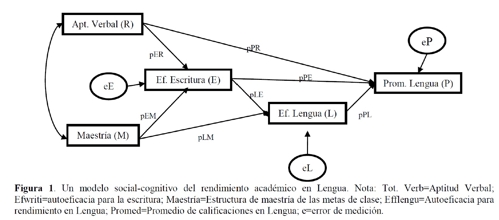
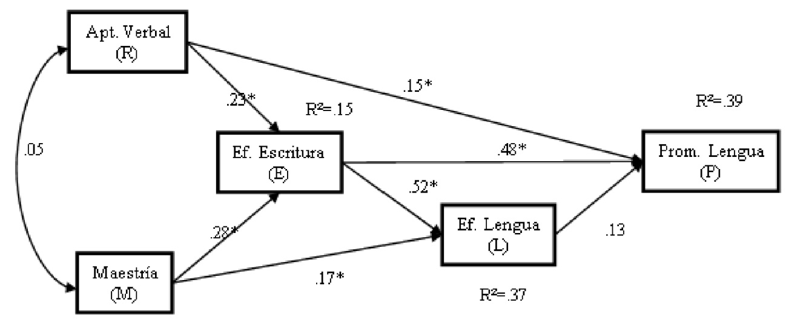

## Contenidos de esta Sesión {.smaller background-color="white"}

**Análisis de Senderos (Parte I)**

1.  **Introducción:** ¿Qué es y para qué sirve el Análisis de Senderos?
2.  **Conceptos Básicos:** Variables, diagramas y coeficientes.
3.  **Descomposición de Efectos:** Directos, indirectos y espurios.
4.  **Supuestos Fundamentales** del Análisis de Senderos.

---
title_slide_background: "#008080" # Puedes cambiar este color si prefieres
---

# 1. Introducción al Análisis de Senderos (Path Analysis)

## ¿Qué es el Análisis de Senderos? {.smaller background-color="white"}

*   El **Análisis de Senderos (Path Analysis - PA)** es una técnica estadística multivariada que permite **evaluar el ajuste de un modelo teórico** que propone una red de **relaciones de dependencia (causales hipotetizadas)** entre un conjunto de variables observadas.
*   **Importante:** El PA **no prueba la causalidad** de forma definitiva, pero sí nos ayuda a:
    *   Determinar si un modelo causal propuesto es **consistente** con los datos.
    *   **Comparar modelos causales alternativos.**
    *   Identificar y cuantificar la fuerza de las diferentes "rutas" o "senderos" de influencia.
*   Es una **extensión del modelo de regresión múltiple**, permitiendo examinar simultáneamente múltiples relaciones de dependencia, incluyendo la contribución **directa e indirecta** de las variables.

## Origen y Evolución del Análisis de Senderos {.smaller background-color="white"}

*   **Orígenes:** Desarrollado por el genetista Sewall Wright a principios del siglo XX para estudios filogenéticos y de herencia.
*   **Introducción a las Ciencias Sociales:** Adoptado y popularizado gradualmente, especialmente a partir de la segunda mitad del siglo XX.
*   **Popularización:** El surgimiento de software estadístico potente (especialmente para Modelos de Ecuaciones Estructurales - SEM) en la década de 1980 facilitó enormemente su aplicación.
*   **Uso Actual:** Ampliamente utilizado en sociología, psicología, economía, ciencia política, educación, ecología y muchas otras disciplinas para modelar sistemas de relaciones.

## Análisis de Senderos (PA) vs. Modelos de Ecuaciones Estructurales (SEM) {.smaller background-color="white"}

*   El **Análisis de Senderos** es, conceptualmente, un **caso especial de los Modelos de Ecuaciones Estructurales (SEM)**.
*   **Diferencia Clave:**
    *   **PA (Clásico):** Trabaja exclusivamente con **variables observadas** (medidas directamente, ej. edad, ingreso reportado, respuestas a ítems de una escala).
    *   **SEM (Completo):** Puede incluir **variables latentes** (constructos no observados directamente, medidos a través de múltiples indicadores) y modelar explícitamente el **error de medición** de esos indicadores.
*   **Variables Observables y Error:** Aunque las variables en PA se miden "directamente", estas mediciones nunca son perfectas. Siempre contienen algún grado de error aleatorio o factores imprevisibles que no son el constructo puro.

## Análisis de Senderos (PA) vs. Modelos de Ecuaciones Estructurales (SEM) {.smaller background-color="white"}

*   **Ventajas del SEM (con latentes):** Permite estimar el impacto del error de medición y establecer la validez de constructo de las variables latentes de forma más rigurosa.
*   **Utilidad del PA:** A pesar de las ventajas del SEM completo, el PA sigue siendo una herramienta **muy útil y ampliamente utilizada**, especialmente cuando:
    *   Las variables de interés son consideradas razonablemente bien medidas por indicadores únicos.
    *   Se quiere explorar o testear modelos causales relativamente sencillos sin la complejidad adicional de modelar variables latentes.
    *   Como un paso previo o simplificado antes de un SEM más complejo.

## Funcionamiento y Propósitos del Análisis de Senderos {.smaller background-color="white"}

*   **Base en Regresión:** El investigador especifica un modelo donde las variables pueden ser predictoras (independientes) de algunas variables y, a su vez, predichas (dependientes) por otras dentro del mismo sistema. Esencialmente, es un **sistema de ecuaciones de regresión interconectadas.**
*   **Evaluación del Ajuste del Modelo:** El objetivo central del PA es determinar el **grado en que el modelo teórico propuesto (la red de senderos) representa adecuadamente las relaciones (covarianzas/correlaciones) observadas en los datos.**
*   **Identificación de Modelos Inadecuados:** Permite detectar si un modelo hipotetizado se ajusta mal a la realidad empírica.

## Funcionamiento y Propósitos del Análisis de Senderos {.smaller background-color="white"}

*   **Estimación de Efectos:** Provee estimaciones de la **magnitud (fuerza) y significancia estadística** de cada relación (sendero) hipotetizada en el modelo.
*   **Representación Gráfica:** Los modelos de senderos se representan visualmente mediante **diagramas de senderos (path diagrams)**.
    *   Las variables se muestran (usualmente en cajas).
    *   Las relaciones hipotetizadas se representan con flechas.
    *   Se estiman **coeficientes path** para cada flecha, análogos a los coeficientes beta (estandarizados) de la regresión múltiple.

---
title_slide_background: "#008080"
---

# 2. Conceptos Básicos del Análisis de Senderos

## Diagrama de Senderos: Un Ejemplo Visual {.smaller background-color="white"}

Este diagrama representa un modelo teórico sobre el rendimiento académico en Lengua.

{fig-align="center" width="90%"}  

## Convenciones Gráficas en el Análisis de Senderos {.smaller background-color="white"}

Los diagramas de senderos usan convenciones visuales estandarizadas:

*   **Variables Observadas:** Se representan con **cuadrados o rectángulos**.
*   **Variables Latentes (si se incluyeran, más propio de SEM):** Se representarían con **círculos u óvalos**. En PA puro, todas son observables.
*   **Relaciones Causales Hipotetizadas (Senderos):**
    *   **Flechas Unidireccionales ($\longrightarrow$):** Indican una supuesta influencia directa de una variable sobre otra. La flecha va de la variable "causa" (predictora) a la variable "efecto" (predicha).
    *   Cada flecha tiene asociado un **coeficiente path**.

## Convenciones Gráficas en el Análisis de Senderos {.smaller background-color="white"}
    
*   **Covariación No Analizada (Correlaciones entre Exógenas):**
    *   **Flechas Bidireccionales Curvas ($\longleftrightarrow$):** Indican que dos variables exógenas covarían (están correlacionadas), pero no se hipotetiza una dirección causal entre ellas dentro del modelo.
*   **Términos de Error/Residuales:**
    *   Se representan con flechas que apuntan a las variables endógenas, originándose "desde fuera" del modelo o desde un círculo (si se representa el error como variable latente). Indican la varianza no explicada.

## Tipos de Variables en un Modelo de Senderos {.smaller background-color="white"}

*   **Variables Exógenas:**
    *   Son aquellas variables cuyas **causas NO están representadas en el modelo**. No reciben flechas de otras variables *dentro* del modelo.
    *   Funcionan como los **predictores iniciales** o puntos de partida del sistema causal.
    *   *En la Figura 1:* Aptitud Verbal (R) y Maestría (M) son exógenas.
*   **Variables Endógenas:**
    *   Son aquellas variables cuyas **causas SÍ están representadas (al menos parcialmente) en el modelo**. Reciben una o más flechas de otras variables (exógenas o endógenas).
    *   Pueden ser **variables dependientes finales** o **variables mediadoras (intervinientes)**.
    *   *En la Figura 1:* Ef. Escritura (E), Ef. Lengua (L), y Prom. Lengua (P) son endógenas.

## Coeficientes Path y Términos de Error {.smaller background-color="white"}

*   **Coeficientes Path (p o $\beta$):**
    *   Son (usualmente) **coeficientes de regresión estandarizados**.
    *   Indican la **magnitud y dirección del efecto directo** de una variable predictora sobre una variable endógena, *controlando por todas las demás variables que también predicen directamente a esa misma variable endógena*.
    *   Se interpretan de forma similar a los Betas en regresión múltiple: "Por cada aumento de una desviación estándar en X, Y cambia en [valor del coeficiente path] desviaciones estándar, manteniendo constantes otras influencias sobre Y".
*   **Términos de Error (o Perturbaciones, $e$ o $\zeta$):**
    *   Cada variable **endógena** tiene un término de error asociado.
    *   Representa la **varianza de esa variable endógena que NO es explicada** por los predictores incluidos en el modelo para ella.
    *   Incluye la influencia de variables omitidas, error de medición aleatorio, y cualquier otra fuente de variación no especificada.
    *   *En la Figura 1:* $e_E, e_L, e_P$.

## Aplicación Práctica: Modelo de Rendimiento en Lengua {.smaller background-color="white"}

Revisitemos el modelo de Pérez, Medrano y Ayllón (2010) sobre rendimiento académico.

*   **Variables Consideradas (todas observables en este PA):**
    *   Aptitud Cognitiva Verbal (R)
    *   Creencias de Autoeficacia para la Escritura (E)
    *   Creencias de Autoeficacia para el Rendimiento en Lengua (L)
    *   Estructura de Metas de Aula de Maestría (M)
    *   Promedio de Calificaciones en Lengua (P) - Variable dependiente final.
*   **Relaciones Propuestas:** El diagrama muestra las hipótesis sobre qué variable influye directa o indirectamente en otra.

## Diagrama del Modelo de Rendimiento en Lengua {.smaller background-color="white"}

{fig-align="center" width="90%"}   
*Este diagrama es la **representación visual de la teoría** que se va a testear.*

## Traducción a Ecuaciones Estructurales {.smaller background-color="white"}

Un modelo de senderos es matemáticamente un sistema de ecuaciones de regresión. Cada variable endógena tiene su propia ecuación.

*   El PA, como extensión de la regresión múltiple, asume **linealidad y aditividad** en las relaciones.
*   **Para la Figura 1, las ecuaciones serían:**

    *   Prom. Lengua (P) = 
        $p_{PR} \cdot \text{Aptitud Verbal (R)}$ + 
        $p_{PE} \cdot \text{Ef. Escritura (E)}$ + 
        $p_{PL} \cdot \text{Ef. Lengua (L)}$ + 
        $e_P$

    *   Ef. Lengua (L) = 
        $p_{LE} \cdot \text{Ef. Escritura (E)}$ + 
        $p_{LM} \cdot \text{Maestría (M)}$ + 
        $e_L$

    *   Ef. Escritura (E) = 
        $p_{ER} \cdot \text{Aptitud Verbal (R)}$ + 
        $p_{EM} \cdot \text{Maestría (M)}$ + 
        $e_E$
        
*   Los términos $e_P, e_L, e_E$ son los **residuos o errores** de cada ecuación.

---
title_slide_background: "#008080"
---

# 3. Descomposición de los Efectos Path

## La Riqueza del PA: Descomponiendo Asociaciones {.smaller background-color="white"}

Una de las grandes fortalezas del Análisis de Senderos es su capacidad para **descomponer la relación total** entre dos variables en diferentes tipos de efectos:

*   **Efectos Directos:** La influencia inmediata, no mediada, de una variable sobre otra. Representada por una flecha directa.
*   **Efectos Indirectos:** La influencia de una variable sobre otra que ocurre **a través de una o más variables mediadoras (o intervinientes)**.
*   **Efectos Totales:** La suma de todos los efectos directos e indirectos de una variable sobre otra.

## La Riqueza del PA: Descomponiendo Asociaciones {.smaller background-color="white"}

*   **Efectos Espurios y No Analizados (Correlaciones):**
    *   **Correlación Espuria:** Parte de la correlación observada entre dos variables que se debe a que ambas son influenciadas por una causa común (o varias).
    *   **Correlación No Analizada:** Correlación entre variables exógenas, que el modelo toma como dada pero no intenta explicar.

## Efectos Directos vs. Indirectos (Ejemplo Simple) {.smaller background-color="white"}

El PA nos ayuda a entender *cómo* una variable afecta a otra.

*   **Efecto Directo:** Ingresos $\longrightarrow$ Horas de Trabajo Doméstico  
    *Aquí, los ingresos influyen directamente en las horas dedicadas al trabajo doméstico.*
    ```{dot}
    digraph G { rankdir=LR; node[shape=box, style=filled, color="#E53935", fontcolor=white]; Ingresos; HDom [label="Horas dedicadas\nal trabajo\ndoméstico"]; Ingresos -> HDom; }
    ```

## Efectos Directos vs. Indirectos (Ejemplo Simple) {.smaller background-color="white"}

*   **Efecto Indirecto:** Ingresos $\longrightarrow$ Contratación de Serv. Domést. $\longrightarrow$ Horas de Trabajo Doméstico  
    *Aquí, los ingresos influyen en la contratación de servicio doméstico, y ésta a su vez influye en las horas que la persona dedica al trabajo doméstico.*  
    ```{dot}
    digraph G { rankdir=LR; node[shape=box, style=filled, color="#E53935", fontcolor=white]; Ingresos; CTDR [label="Contratación de\ntrabajo doméstico\nremunerado"]; HDom [label="Horas dedicadas\nal trabajo\ndoméstico"]; Ingresos -> CTDR -> HDom; }
    ```
    *Aquí, los ingresos influyen en la contratación de servicio doméstico, y ésta a su vez influye en las horas que la persona dedica al trabajo doméstico.*

## Estimación y Significación de los Efectos Path {.smaller background-color="white"}

*   **Coeficientes Path (Efectos Directos):**
    *   Se estiman como coeficientes de regresión, usualmente **estandarizados (Betas)**.
    *   Indican el cambio en DE en la variable dependiente por un cambio de una DE en la predictora, controlando otras predictoras de esa misma dependiente.
*   **Efectos Indirectos:**
    *   Se calculan **multiplicando los coeficientes path estandarizados** a lo largo de un sendero mediado.
    *   *Ejemplo (Figura 1):* Efecto indirecto de Ef. Escritura (E) sobre Prom. Lengua (P) *vía* Ef. Lengua (L) = $p_{EL} \times p_{LP}$. Si $p_{EL}=0.52$ y $p_{LP}=0.13$, el efecto indirecto es $0.52 \times 0.13 = 0.0676$.

## Estimación y Significación de los Efectos Path {.smaller background-color="white"}    

*   **Efecto Total:**
    *   Suma del efecto directo (si existe) y todos los efectos indirectos significativos entre dos variables.
*   **Significancia Estadística:**
    *   Para los efectos directos, se obtiene de la salida de regresión (t-value o z-value, p-valor).
    *   Para efectos indirectos y totales, se pueden usar métodos como el *bootstrapping* o la prueba de Sobel para estimar su significancia (`lavaan` lo puede hacer).

## Ejemplo: Descomposición de Efectos (Diagrama con Coeficientes) {.smaller background-color="white"}

::: columns
::: {.column width="50%"}
{fig-align="center"}
*En este diagrama, los números en las flechas son coeficientes path estandarizados. Los $R^2$ indican la varianza explicada de las variables endógenas.*
:::

::: {.column width="50%"}
<div style="font-size: 0.7em; line-height: 1.2;"> 
**Interpretando los Senderos:**

*   **Efecto Directo:**
    *   De Metas de Maestría sobre Autoeficacia en Escritura es 0.28.

*   **Efectos Indirectos (Ejemplos hacia Rendimiento en Lengua):**
    *   El efecto de Metas de Maestría sobre Rendimiento en Lengua, mediado por Autoeficacia en Escritura y luego por Autoeficacia en Lengua, se calcula:
        $0.28 \times 0.52 \times 0.13 \approx 0.019$.
    *   El efecto de Metas de Maestría sobre Rendimiento en Lengua, mediado solo por Autoeficacia en Lengua, es:
        $0.17 \times 0.13 \approx 0.022$.

*   **¡Y hay más posibles efectos indirectos y totales que se pueden calcular!**
</div>
:::
:::

## Actividad 1: De la Teoría al Diagrama de Senderos {.smaller background-color="white"}
<div style="font-size: 0.7em; line-height: 1.2;"> 
**Instrucción:** Lean cada uno de los siguientes escenarios teóricos. Para cada uno, identifiquen las variables clave y dibujen un diagrama de senderos que represente las relaciones causales hipotetizadas.

1.  Se postula que la **esperanza de vida** de las personas se ve disminuida por su **consumo de drogas**. A su vez, la probabilidad de que una persona consuma drogas está inversamente relacionada con su **nivel de ingresos**. Finalmente, se considera que un mayor **nivel de ingresos** tiene un efecto positivo directo sobre la **esperanza de vida**.

2.  Se teoriza que la **calidad del ambiente en el hogar** influye positivamente en el **desarrollo cognitivo infantil**. Este desarrollo cognitivo, a su vez, mejora el **rendimiento escolar**. Además, la **calidad del ambiente en el hogar** también fomenta un mejor **desarrollo emocional infantil**. Un adecuado desarrollo emocional incrementa la **autoeficacia** del niño o niña, y esta autoeficacia tiene un impacto positivo en el **rendimiento escolar**. Por otra parte, se sabe que el **ingreso del hogar** puede afectar tanto el **rendimiento escolar** directamente, como la propia **calidad del ambiente en el hogar**.

3.  Un modelo sobre acción colectiva sugiere que la **clase social** de un individuo influye en su **participación en protestas**, pero este efecto no es directo, sino que opera a través de tres mecanismos distintos. Primero, la **clase social** moldea la **percepción de tener una identidad agraviada**. Esta percepción, a su vez, incrementa la tendencia a realizar una **justificación exogrupal del agravio** (es decir, atribuir la causa del agravio a un grupo externo). Finalmente, esta justificación aumenta la **participación en protestas**. Un segundo mecanismo es que la **clase social** afecta la **percepción sobre la eficacia de las protestas**, y una mayor percepción de eficacia lleva a mayor **participación en protestas**. El tercer mecanismo postula que la **clase social** influye en la **legitimidad que se atribuye a las protestas**, y una mayor percepción de legitimidad también incrementa la **participación en protestas**.
</div>

---
title_slide_background: "#008080"
---

# 4. Supuestos del Análisis de Senderos

## Supuestos Clave del Path Analysis {.smaller background-color="white"}

El PA es una extensión de la regresión múltiple; por lo tanto, muchos supuestos son similares, más algunos específicos del modelo:

*   **Correcta Especificación del Modelo:**
    *   **Teoría Sólida:** El modelo debe estar bien fundamentado teóricamente.
    *   **Variables Incluidas:** Todas las variables relevantes deben estar en el modelo. La omisión de variables importantes puede sesgar los resultados.
    *   **Direccionalidad:** Las flechas causales deben tener justificación teórica.
*   **Exploración y Limpieza de Datos:**
    *   **Valores Extremos (Outliers):** Detectar y tratar outliers univariados (puntajes Z) y multivariados (Distancia de Mahalanobis, $D^2$). Pueden distorsionar gravemente las estimaciones.
    *   **Valores Perdidos (Missing Data):** Evaluar cantidad y patrón. Considerar métodos de imputación si son numerosos o no aleatorios.

## Supuestos Clave del Path Analysis  {.smaller background-color="white"}

*   **Tamaño de la Muestra:**
    *   No hay reglas fijas, pero se recomienda:
        *   Mínimo 10-20 casos *por parámetro libre a estimar* en el modelo.
        *   Un N total de al menos 200 observaciones es una guía general para obtener estimaciones estables. Modelos más complejos requieren N mayores.
*   **Independencia de los Errores (Residuales):**
    *   El término de error de cada variable endógena NO debe estar correlacionado con las variables exógenas que la predicen.
    *   Los términos de error de diferentes variables endógenas NO deben estar correlacionados entre sí (a menos que se especifique teóricamente dicha correlación en el modelo, lo cual es posible en `lavaan`).  
    
## Supuestos Clave del Path Analysis  {.smaller background-color="white"}
    
*   **Normalidad (para estimación ML y tests de significancia estándar):**
    *   Idealmente, las variables (o los residuos de las ecuaciones) deberían seguir una distribución normal multivariada.
    *   Evaluar asimetría y curtosis univariada, y tests de normalidad multivariada (ej. Mardia).
    *   Si hay no-normalidad severa, considerar estimadores robustos (ej. DWLS en `lavaan` si se usan datos ordinales, o bootstrap).

## Supuestos Clave del Path Analysis {.smaller background-color="white"}

*   **Linealidad y Aditividad:**
    *   Se asume que las relaciones entre las variables son **lineales**. Si se sospechan relaciones no lineales, se deben modelar explícitamente (ej. términos cuadráticos) o usar otras técnicas.
    *   Se asume que los efectos son **aditivos** (no se modelan interacciones por defecto, aunque pueden incluirse).
*   **Baja Multicolinealidad:**
    *   Las variables exógenas (o predictores de una misma endógena) no deben estar excesivamente correlacionadas entre sí (ej. |r| > 0.80 o 0.85). Dificulta la estimación de efectos únicos y puede inflar errores estándar.

## Supuestos Clave del Path Analysis {.smaller background-color="white"}    

*   **Recursividad (Modelo Estándar):**
    *   Las influencias causales son **unidireccionales** (no hay flechas que vuelvan sobre sí mismas directa o indirectamente, formando "loops" o ciclos).
    *   Los modelos no recursivos (con feedback loops) son posibles pero más complejos de estimar e identificar.
*   **Nivel de Medición:**
    *   Idealmente **intervalar o de razón** para estimadores como ML u OLS.
    *   Variables **ordinales** pueden usarse si se tratan como continuas (con suficientes categorías y distribuciones no muy problemáticas) o, más apropiadamente, con estimadores diseñados para datos categóricos (ej. DWLS en `lavaan`).
*   **Confiabilidad de las Medidas:**
    *   Se asume que las variables observadas miden sus respectivos conceptos de manera **confiable** (con bajo error de medición aleatorio). El PA clásico no modela explícitamente el error de medición (a diferencia de SEM con variables latentes).

