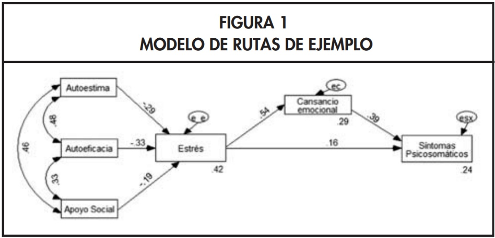

## Objetivos de la Sesión {.smaller background-color="white"}

-   **Comprender** qué son los Modelos de Ecuaciones Estructurales (SEM) y cómo integran las técnicas vistas anteriormente (AFC y Análisis de Senderos).
-   **Identificar** los componentes clave de un SEM: el modelo de medida y el modelo estructural.
-   **Reconocer** los distintos tipos de variables y relaciones que se pueden modelar.
-   **Entender** el proceso de especificación, estimación y evaluación de un modelo SEM.
-   **Conocer** los principales supuestos y los índices de ajuste utilizados para validar estos modelos.

---
title_slide_background: "#008080"
---

# 1. Modelos de Ecuaciones Estructurales (SEM)

## Introducción a los Modelos de Ecuaciones Estructurales {.smaller background-color="white"}

Los **Modelos de Ecuaciones Estructurales (SEM)** son una familia de modelos estadísticos multivariantes que representan la **culminación de las técnicas que hemos estudiado**, permitiendo estimar y testear complejas redes de relaciones entre múltiples variables.

-   Nacieron de la necesidad de superar las limitaciones de los modelos de regresión tradicionales.
-   Su principal ventaja es la flexibilidad: son menos restrictivos al permitir **modelar explícitamente el error de medición**, tanto en las variables que actúan como predictoras como en las que son predichas.

En resumen, los SEM nos permiten testear teorías sociológicas completas, que involucran tanto la medición de conceptos abstractos como las relaciones causales entre ellos.

## La Lógica Confirmatoria de los SEM {.smaller background-color="white"}

-   **Guiados por la Teoría:** Los SEM son fundamentalmente **modelos confirmatorios**. El investigador debe proponer, *a priori*, un modelo que especifique el tipo y la dirección de todas las relaciones de interés, basándose en un sólido marco teórico o en evidencia empírica previa.
-   **Objetivo Principal:** El interés no es explorar, sino **"confirmar"** si la estructura de relaciones hipotetizada es consistente con los datos observados en una muestra.
-   **Base Empírica:** La estimación del modelo se basa en analizar la **matriz de varianzas y covarianzas** (o de correlaciones) de las variables observadas. El modelo se considera bueno si la matriz de covarianzas que *implica* nuestro modelo teórico es muy similar a la que *observamos* en nuestros datos.

## Ejemplo de Aplicación en Salud {.smaller background-color="white"}

Imaginemos un modelo que busca explicar los **síntomas psicosomáticos**.

-   **Teoría:** Se postula que antecedentes personales como la **autoestima**, la **autoeficacia** y el **apoyo social** influyen en los síntomas, pero no solo directamente, sino también a través de variables mediadoras como el **estrés** y el **cansancio emocional**.
-   **Análisis con SEM:** La interpretación de los parámetros estimados (los "paths" o senderos) nos permite constatar estas relaciones. Por ejemplo, podríamos evaluar si el apoyo social tiene un efecto negativo sobre el estrés (reduciéndolo) y si, a su vez, el estrés tiene un efecto positivo sobre los síntomas psicosomáticos. El modelo nos permitiría cuantificar tanto los efectos directos como los indirectos.

{fig-align="center"}

## SEM y Causalidad: Una Advertencia Crucial {.smaller background-color="white"}

**1. Estimación Estadística NO es Prueba Causal:**

-   Aunque los diagramas SEM utilizan flechas que representan una **hipótesis de influencia causal**, la estimación de un parámetro significativo **NO demuestra por sí sola la existencia de causalidad**.\
-   SEM es una técnica que evalúa la **consistencia de los datos con un modelo causal propuesto**. Un buen ajuste del modelo significa que la teoría no es refutada por los datos, pero no que es la única explicación posible.\
-   La defensa de la causalidad requiere, además del ajuste estadístico, un **sólido argumento teórico** y, preferiblemente, un **diseño de investigación** que permita inferencia causal (ej. datos longitudinales, diseños experimentales o cuasi-experimentales).

## SEM y Causalidad: Una Advertencia Crucial {.smaller background-color="white"}

**2. Verificación de Teorías:**

-   La lógica es: "Si mi teoría es una buena representación de la realidad, entonces la estructura de covarianzas que mi teoría implica debería ser muy similar a la estructura de covarianzas que observo en mis datos".\
-   SEM nos proporciona una herramienta poderosa para realizar esta comprobación de forma rigurosa.

## Estructura de un Modelo SEM: Un Modelo de "Dos Partes" {.smaller background-color="white"}

Un modelo SEM completo se puede entender como la unión de dos sub-modelos que se estiman simultáneamente:

**1. Modelo de Medida:**

-   **Propósito:** Define cómo cada **constructo latente** se mide a través de sus **indicadores observables**.\
-   **Equivalencia:** Es, en esencia, un **Análisis Factorial Confirmatorio (AFC)**. Especifica qué ítems cargan en qué factores, permitiendo evaluar la validez y fiabilidad de nuestras mediciones al modelar explícitamente el error de cada indicador.

## Estructura de un Modelo SEM: Un Modelo de "Dos Partes" {.smaller background-color="white"}

**2. Modelo Estructural:**

-   **Propósito:** Define las **relaciones causales (paths) hipotetizadas entre los constructos** (generalmente, entre las variables latentes).\
-   **Equivalencia:** Es, en esencia, un **Análisis de Senderos (Path Analysis)**. Permite testear hipótesis sobre efectos directos e indirectos.

## Casos Especiales de SEM que ya conocemos {.smaller background-color="white"}

1.  **Análisis Factorial Confirmatorio (AFC):** Es un SEM que **solo contiene el modelo de medida**. Se enfoca en la calidad de la medición y las relaciones entre los factores son solo correlacionales, no direccionales.
2.  **Análisis de Senderos (Path Analysis):** Es un SEM que **no contiene variables latentes**; las variables observadas se tratan como si fueran mediciones perfectas de los conceptos (se equiparan las variables observadas con las latentes). Por lo tanto, solo existe el modelo estructural y los errores de medición se confunden con los errores de predicción en un único término de error para cada variable endógena.

## Tipos de Variables en un Modelo Estructural {.smaller background-color="white"}

::: {style="font-size: 0.9em; line-height: 1.2;"}
1.  **Variable Observada o Indicador:** Se mide directamente en los datos (ej. preguntas de un cuestionario).
2.  **Variable Latente (o Factor):** Constructo teórico que no se observa directamente y que el modelo asume está libre de error de medición. Se infiere a partir de sus indicadores.
3.  **Variable de Error:** Representa la varianza no explicada. Hay dos tipos:
    -   **Error de Medición:** Asociado a cada indicador, es la varianza de ese indicador que no es explicada por su factor latente.
    -   **Error Estructural (o Perturbación):** Asociado a cada variable *endógena* (latente u observada), es la varianza de esa variable que no es explicada por sus predictores en el modelo.
4.  **Variable Exógena:** Sus causas están fuera del modelo. No recibe flechas direccionales de ninguna otra variable en el modelo.
5.  **Variable Endógena:** Recibe al menos una flecha direccional. Su variación es (parcialmente) explicada por el modelo.
:::

## Diagramas Estructurales: Convenciones {.smaller background-color="white"}

**1. Representación de Variables:**

-   **Rectángulos:** Variables Observables (Indicadores).\
-   **Óvalos o Círculos:** Variables No Observables (Latentes, Errores).

**2. Representación de Relaciones:**

-   **Flechas Rectas Unidireccionales (**$\longrightarrow$): Efectos estructurales directos (regresión).\
-   **Flechas Curvas Bidireccionales (**$\longleftrightarrow$): Correlaciones o covarianzas no analizadas (generalmente entre variables exógenas o entre términos de error).\
-   **Parámetros:** Los coeficientes (cargas, paths) se pueden mostrar sobre las flechas.

**3. Término de Error:**

-   Cada variable **endógena** (latente u observada) debe tener un término de error asociado, representado por una flecha que apunta hacia ella.

## Ejemplo de un Modelo SEM Completo {.smaller background-color="white"}

:::::: columns
:::: {.column width="50%"}
::: {style="font-size: 0.9em; line-height: 1.2;"}
**Teoría del Modelo:**

-   **Constructos Latentes:** Autoestima, Autoeficacia, Apoyo Social (exógenos); Estrés, Cansancio Emocional, Síntomas Psicosomáticos (endógenos).
-   **Modelo Estructural (Fig. 4):** Hipotetiza las relaciones causales entre los constructos.
-   **Modelo de Medida (Fig. 5):** Cada constructo se mide a través de tres indicadores observables (ej. `INDI1CE`, `INDI2CE`, `INDI3CE` para Cansancio Emocional).
-   **Modelo Final (Fig. 5):** Integra ambas partes, permitiendo analizar las relaciones entre los constructos mientras se controla el error de medición.
:::
::::

::: {.column width="50%"}
**Figura 4: Modelo Estructural** 
:::
::::::

## Ejemplo de un Modelo SEM Completo {.smaller background-color="white"}

{width="600"}

*Figura 5: Modelo Final Estimado (con modelo de medida)*

## Tipos de Relaciones en SEM {.smaller background-color="white"}

Los SEM nos permiten explorar una rica variedad de relaciones entre variables:

1.  **Covariación vs Causalidad:** Distinguir entre mera asociación y relaciones direccionales hipotetizadas.
2.  **Relación Espuria:** Identificar cuando la correlación entre dos variables se debe a una causa común.
3.  **Relación "Causal" Directa e Indirecta:** Descomponer el efecto total, identificando mecanismos de mediación.
4.  **Relación "Causal" Recíproca:** Modelar bucles de retroalimentación (feedback loops).
5.  **Efectos Totales:** La suma de los efectos directos e indirectos.

## Supuestos de los Modelos de Ecuaciones Estructurales {.smaller background-color="white"}

-   **Tamaño de muestra suficientemente grande:** Mínimo 200, pero idealmente 10-20 casos por parámetro a estimar.
-   **Relaciones lineales** entre las variables.
-   **Normalidad multivariante** (importante para el método de estimación ML).
-   **Identificación del modelo** (grados de libertad \> 0).
-   **Ausencia de multicolinealidad** entre predictores.
-   **Variables continuas** (o uso de estimadores apropiados para categóricas como DWLS).

---
title_slide_background: "#008080"
---

# Pasos de un Modelo de Ecuaciones Estructurales

## Paso 1: Especificación del Modelo {.smaller background-color="white"}

1.  **Base Teórica:** La teoría que respalda el modelo debe estar formulada de tal manera que pueda ser probada con datos reales. Se deben incluir todas las variables consideradas teóricamente importantes.
2.  **Definir Relaciones:** Especificar las relaciones esperadas entre todas las variables: correlaciones entre exógenas, efectos directos (paths) en el modelo estructural, y qué indicadores miden qué factores en el modelo de medida.
3.  **Formular en Diagrama:** Dibujar el modelo teórico en un formato gráfico. Esto ayuda a visualizar, clarificar y traducir las hipótesis en las ecuaciones y parámetros que el software estimará.

## Paso 2: Identificación del Modelo {.smaller background-color="white"}

-   Al igual que en el análisis de senderos, debemos asegurarnos que contamos con **información suficiente para estimar el modelo**.
-   Cada parámetro debe estar correctamente identificado y ser derivable de la información en la **matriz de varianzas-covarianzas** de las variables observadas.
-   Debemos revisar que los **grados de libertad (gl) sean mayores a 0**, lo que indica un modelo sobreidentificado y testeable.
-   **Estrategias para garantizar la identificación:** usar al menos tres indicadores por variable latente; fijar la métrica de cada variable latente (ej. fijando una carga a 1 o la varianza del factor a 1).

## Paso 3: Estimación del Modelo {.smaller background-color="white"}

1.  Se estiman los parámetros del modelo (cargas, paths, varianzas, etc.) a partir del modelo especificado.
2.  El método por defecto en `lavaan` es **Máxima Verosimilitud (ML)**, que busca los valores de los parámetros que maximizan la probabilidad de observar la matriz de covarianzas de la muestra. Hay otros estimadores disponibles (ej. DWLS, MLR) para datos que no son normales o son categóricos.

## Paso 4: Evaluación de Ajuste {.smaller background-color="white"}

1.  **Valorar el ajuste del modelo:** Si las estimaciones obtenidas no reproducen correctamente la matriz de covarianzas observada en los datos, será necesario rechazar el modelo y/o reformularlo.
2.  **Doble Desafío en SEM:** Un buen ajuste en SEM requiere que **tanto el modelo de medición como el modelo estructural se ajusten bien a los datos simultáneamente**, lo cual es una prueba más exigente que evaluar cada parte por separado.

## Estadísticos de Bondad de Ajuste {.smaller background-color="white"}

::::: columns
::: {.column width="50%"}
Se utilizan tres tipos de estadísticos:

-   **Ajuste Absoluto:** Valoran qué tan bien el modelo reproduce los datos sin un punto de comparación (ej. $\chi^2$, RMSEA).
-   **Ajuste Relativo (Incremental):** Comparan el ajuste del modelo propuesto con un modelo base (normalmente el "modelo nulo" de independencia) (ej. CFI, TLI).
-   **Ajuste Parsimonioso:** Evalúan el ajuste penalizando por la complejidad del modelo (ej. AIC, BIC, PNFI).

Se debe reportar un conjunto de índices de diferentes tipos para una evaluación robusta.
:::

::: {.column width="50%"}
 *(Tabla de referencia con criterios comunes)*
:::
:::::

## Chi Cuadrado ($\chi^2$) {.smaller background-color="white"}

-   Es conceptualmente el más atractivo, ya que contrasta la hipótesis nula de que el modelo se ajusta perfectamente a los datos poblacionales (todos los errores del modelo son nulos).
-   Sin embargo, es **muy sensible al tamaño de la muestra**: con muestras grandes (N \> 200-400), es muy probable que resulte significativo (p \< 0.05), llevando a rechazar modelos que en la práctica son muy buenos.
-   Por lo tanto, además de valorar su significación estadística, suele compararse con sus grados de libertad (Criterio: $\chi^2/gl$ \< 2 o 3).
-   A pesar de sus limitaciones, siempre se debe informar este estadístico.

## Paso 5: Re-especificación {.smaller background-color="white"}

-   Si el modelo presenta un ajuste insatisfactorio, se pueden introducir modificaciones (agregar o quitar parámetros).
-   Este proceso debe ser guiado por los **índices de modificación** y el análisis de los **residuos**, pero **siempre justificado por la teoría**.
-   Los cambios propuestos deben ser coherentes con el marco conceptual. No se debe "cazar el ajuste" a costa del sentido teórico.

## Paso 6: Interpretación de Resultados {.smaller background-color="white"}

-   **Coeficientes Beta Estandarizados:** Se interpretan como en regresión o análisis de senderos. Representan el cambio en desviaciones estándar en la variable dependiente por un cambio de una DE en la predictora, controlando por otras.
-   **Significación de cada coeficiente:** Se evalúa con el p-valor (usualmente p \< 0.05) para determinar si el efecto es estadísticamente diferente de cero.
-   **R-cuadrado (**$R^2$): Representa el porcentaje de la varianza en cada **variable endógena** (tanto latente como observada) que es explicado por sus predictores en el modelo.
-   **Atención al Doble Papel:** En SEM, los coeficientes describen tanto el **modelo de medición** (cargas) como el **modelo estructural** (paths). Es crucial interpretar ambos niveles para una comprensión completa del modelo.
